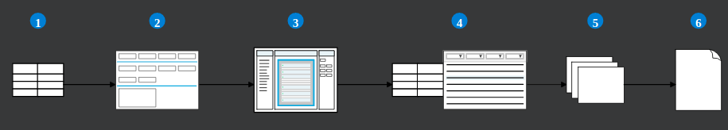

---
 Top
---

- ### [Reports](#Reports)

---

## Reports

Application builders can create report templates and report applications that allow business users to generate reports.

Nextworld reports are a type of document created from compiled data in tables. You build reports over existing data that is stored in a Nextworld table. A report data source table can be a standard table or a flat table. Learn more about flat tables in the FLAT TABLE REPORTS topic.

All the data stored in the data source table becomes available in the Report Builder component of the Report application. The Report Builder is where you are able to build a report template, which is an outline of which data items you want represented and how you want the report structured when users run reports and data is populated. Learn more about the Report Builder in the REPORT BUILDER section.

> ### In order for users to run reports, you need to build a report table over the Report Builder template, and a report application over the report table. The report application is where users can define their criteria for what data they want reflected in a report.

The diagram below depicts the report building process using the following Nextworld objects:

## 

1. **Data source table** - The standard or flat table with data that you want to be displayed in a report. This can be a new or existing table.

2. **Report record** - Create a record in the **Reports** application with the basic information about the report, including name, product family and module, and driver table.

3. **Report builder** - Design a template for how you want data presented in the generated report.

4. **Report table and report application** - Create a table and an application where users can trigger a report to be run.

5. **Report versions** - Create multiple records in the report application to build different versions of a report.

6. **Report** - Run a report record to view a finalized report.

- [Top](#Back_To_Top)

---
