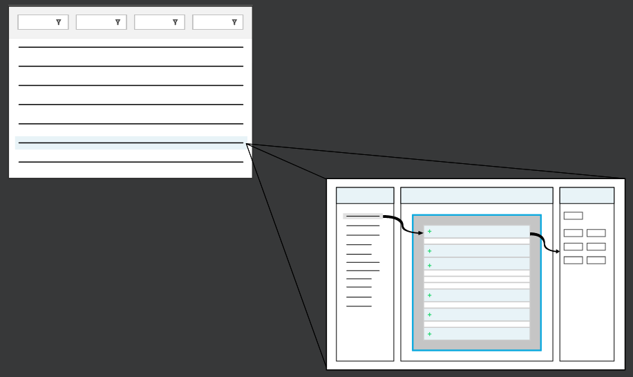
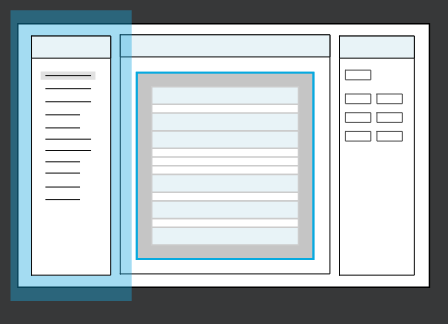
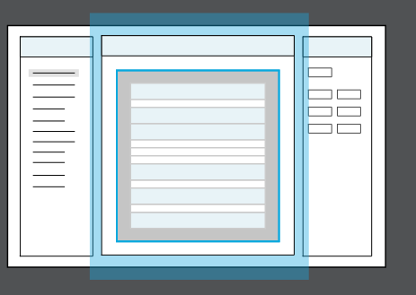
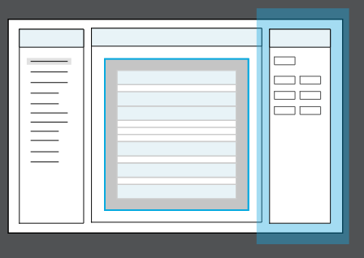

---
 Top
---

- ### [1 TEMPLATE](#1_TEMPLATE)

---

## 1 TEMPLATE

---

- [Top](#Back_To_Top)

---

---

##  Top

---

- ### [Report Builder](#Report_Builder)
- ### [Struture Report Panel](#Structure_Report_Panel)
- ### [Viewer Report Panel](#Viewer_Report_Panel)
- ### [Editor Report Panel](#Editor_Report_Panel)

## Report Builder

Report Builder is a component of the **Reports** application that you use to configure what data from the source table is included in the report, as well as how it's laid out. Access the Report Builder from records in the Reports application.

The diagram below shows the flow from the **Reports** application to the Report Builder.

## 

The _Report Builder_ is where you assemble the components of a report. It is a builder tool where you can build the structure of a report template as well as add and reorder content items. Report Builder is made of three panels for you to work with:

1. **Structure** - List of data and inputs available in the report. Use the structure tree to add, remove, and reorder items within sections of the report. Learn more in the STRUCTURE REPORT PANEL topic.

2. **Viewer** - A visual representation of the report where you can select content items to edit their properties, move them around, or resize them. Learn more in the VIEWER REPORT PANEL topic.

3. **Editor** - Properties of various parts of the report. View and configure properties by selecting a node in the Structure panel, or an item in the Viewer panel to edit its properties. For example, if you select the Fields node in the Structure panel, you would be able to view all the fields from the data source table that you can use in the report. Or if you select a content box in the Viewer panel, you can configure which section the content box is in, it's height, width, type and so on. Learn more in the EDITOR REPORT PANEL topic.

### Button Bar

The Report Builder buttons gives you some additional options to interact with your report template:

1. **Preview** - Use this toggle to view the report template you built as a .pdf file with data pulled in from the data source table. A report application must exist in order to use the preview option. If you have any additional data items that you have added as input values, they appear blank in the preview because these data items do not originate from the data source table.

2. **Draft** - _Save a report template even though errors have been detected._ In order to save outside of draft mode, you must resolve those errors. If there is a report application built over the report template and you save the template in draft mode with errors, then reports in the report application fail anywhere you are able to run them.

3. **Actions** - Form actions in the Actions drop-down menu help **simplify creation of an input table and creation of a report application over the input table**. The actions also allow you to quickly edit the input table and report application when you make changes to the Inputs section in the Report Builder.

---

- [Top](#Back_To_Top)

---

## Struture Report Panel

The Structure panel tree of the Report Builder is a list of options that allow you to build your report layout and define the data you want used to generate a report.

## 

There are two parts that make up the Structure tree: a report outline of all content items in the Viewer panel and a compilation of data available to the report.

> ### Find configuration options for the items you select in Structure tree in the Editor panel of the Report Builder. Learn more in the EDITOR REPORT PANEL topic.

### Report outline

The report outline sits under the **Report** item in the Structure tree. Each item in the outline corresponds to a specific section of the report and gives you control over the content you want to add to that section. Every item, other than the **Report** item, allows you to add content to a specific section of the report.

When you select a report outline section item in Structure panel tree, you can add, delete, or reorder content items using the tree buttons for that section. After you add content to a section, you can format and modify the dimensions of the content in the Editor panel.

The following items make up the report outline:

- Reports
- Report Title
- Page Header
- Sections
  - Header
  - Detail
  - Footer
- Page Footer
- Last Page Footer
- Report Summary
- No Data

### Data management

The rest of the items in the Structure tree allow you to select and manipulate data for your report. The following items allow you to manage data that is available for you to use in your report:

| Item   | Details                                                                                                                                                                                                                                                                                                      |
| ------ | ------------------------------------------------------------------------------------------------------------------------------------------------------------------------------------------------------------------------------------------------------------------------------------------------------------ |
| Fields | A list of fields from the driver table that appear as soon as you select a value in the **Data Source Table** field.                                                                                                                                                                                         |
| Inputs | Report options that users can interact with in the report application. Inputs are not pulled from the driver table, but can be directly placed somewhere on the report, such as `ReportTitle`. Inputs can also be used in the report application to filter which records come from the driver table.         |
| Filter | Defines how records are excluded from the data source. Optionally, the **Report Filter** input either replaces the filter defined in the report or augments it. The **Report Application Customization** value lets you decide how the **Report Filter** input behaves in applications that run this report. |
| Sort   | Defines how records are ordered in the report. Optionally, the **Report Sort** input either replaces the sort defined in the report or augments it. The **Report Application Customization** value lets you decide how the **Report Sort** input behaves in applications that run this report:               |

---

- [Top](#Back_To_Top)

---

## Viewer Report Panel

The Viewer panel of the Report Builder is a visual representation of the report where you are able to directly select items and edit their properties.

## 

Collapse the **Viewer** display to hide the section labels of the report. This allows you to see a representation of what the report looks like without using the **Preview** button.

When you select a section in Viewer panel, you can add, delete, or reorder content items for that section. After you add content to a section, you can format the content and modify the dimensions of the content in the Editor panel. To delete content, use the keyboard delete after clicking on an item in the viewer. Reorder content items by dragging and dropping them within the Viewer panel.

### Resizing sections and content items

Use the behaviors to modify how things display in the Viewer panel:

- Drag the bottom of a section to change its height.
- Drag the edge of a content item to resize it.
- Drag the middle of a content item to move it around.
- Double-click a section resize bar to make the section as tall as its contents.

### Groups

Press the **Add Group** icon at the right side of the **Detail** section to add a group. This adds **Group Header** and **Group Footer** sections above and below the detail, whose properties you can edit to determine how fields will be grouped in those sections.

---

- [Top](#Back_To_Top)

---

## Editor Report Panel

The Editor panel of the Report Builder is where you specify how every section and every piece of content in your report looks and behaves.

## 

The Editor panel allows you to configure the properties of the selected items from the Structure tree and Viewer panel. The items from those two panels are either section items, controlling specific areas of the report, or content items, the data that you want to be represented in the report.

The following are a item properties that you can configure in the Editor panel:

- Section
- Dimensions and location
- Type
- Styles
- Visibility

### Type

The **Type** dropdown determines where this content item gets its value. It has a few different options:

| Type         | Purpose                                                                                                                                             |
| ------------ | --------------------------------------------------------------------------------------------------------------------------------------------------- |
| Box          | Provides an easy way to draw a rectangle around other content in the selected section, when combined with the border options in the Styles section. |
| Constant     | Allows you to specify a value for the selected content item. This value can never change.                                                           |
| Field        | Displays the current value of a particular field from the report data source in the selected content unit.                                          |
| Expression   | Performs basic mathematical functions and display the result as the selected content item's value.                                                  |
| Input        | Uses a selected input as the value of the selected content unit.                                                                                    |
| Subreport    | Displays the selected sub report in the selected content unit.                                                                                      |
| System Value | Uses a special value for the selected content item, such as the current date or the current page number.                                            |

---

- [Top](#Back_To_Top)

---
