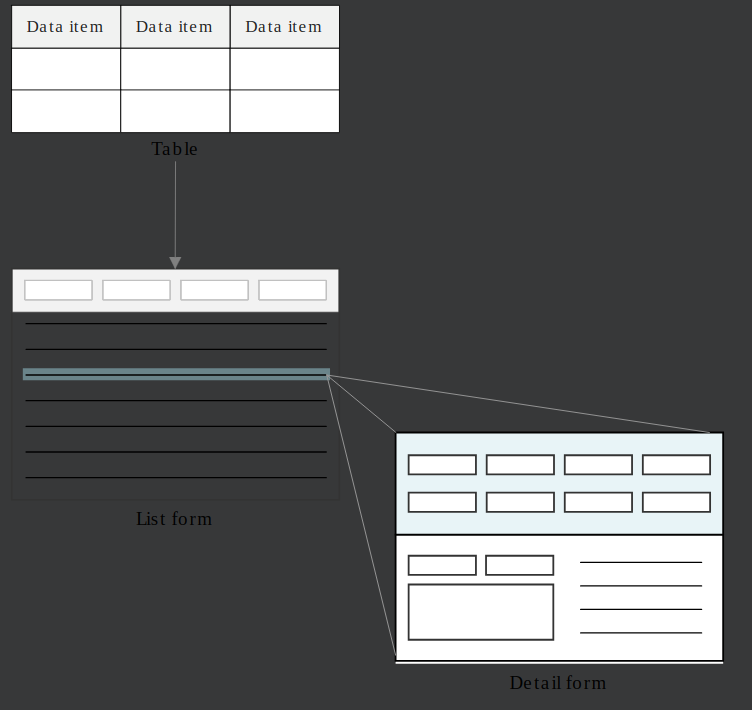

# Build an application

In this tutorial, you'll learn about, and then create, the different objects that make up a Nextworld application.

You'll create an application used to store records about company credit card information.

- You'll start by creating different types of data items for different types of values.
- Then you'll create a table lookup to retrieve values from other tables, and a list lookup to provide a list of values a user can select.
- You'll create a table and add your data items to it. Then you'll build an application over your table and configure your field layout.
- You'll learn about, and then configure menu records and add an application setting for different audiences.
- To make sure your application is a success, you'll open the application from the menu, and then create and save a record.

A Nextworld application is made up of these basic elements.

- 1. **_DATA ITEMS_** are the foundation of all Nextworld applications. Everything is built on data items.
- 2. Data items are organized into **_TABLES_**. Each table is made up of a group of related data items, where the data items represent columns in the table.
- 3. Tables can reference data items in other tables using **_TABLE LOOKUPS_**. This allows tables to share information.
- 4. **_APPLICATIONS_** are built on tables. Data items in the table are available as fields in the application.
- 5. You can control and manipulate the fields in the application using **_LOGIC BLOCKS_**. Logic blocks allow you to perform complex operations on the data in the various fields including validating entries, imposing conditional requirements, hiding and showing fields, and so on.
- 6. The application reads and writes records in the table. A record is a row or entry in the table, a collection of values assigned to each data item in the table.

---

 Top

---

- ### [1 DATA ITEMS](#1_DATA_ITEMS)
- ### [2 TABLES](#2_TABLES)
- ### [3 TABLE LOOKUPS](#3_TABLE_LOOKUPS)
- ### [4 APPLICATIONS](#4_APPLICATIONS)
- ### [5 LOGIC BLOCKS](#5_LOGIC_BLOCKS)

---

## 1 DATA ITEMS

The _data item_ is the most granular building block of an application. Each _data item_ represents one unit of information. Every attribute, property, and field is built on top of a _data item_.

Additionally, each _data item_ is of a particular type. The _data item type_ captures the semantics of different types of information and provides commonly used controls to further define the information stored in a particular _data item_. For example, a picture _data item_ always holds an image, but you can set further controls on how images are displayed, including whether the image has a border, square or rounded edges, and its aspect ratio. Those controls are all included with the _data item_ type.

When you identify a piece of information that you need to track, choose the right _data item_ type to capture that information in the most efficient way. For example, to track employee birthdays, use a date _data item_. To store the prices of inventory items, use a currency _data item_.

The diagram below shows _data items_, organized into tables, and then displayed in applications.

---

- [Top](#Back_To_Top)

---

## 2 TABLES

Tables are the foundation for an application. A table is a collection of related data items that display as fields in your application. Applications store data in, and retrieve data from, tables.

When creating a table, you enter fields to create both column headers and detail view items for your application. The table rows become records in your application.

When you add a record in your application, it is saved as a row in your table.

Tables can include both data items that appear as fields in the application and data items that are never made visible in the application. Data items that don't appear in the application are either needed for logic blocks or are not necessary for the user.

Multiple applications can be built over the same table. If multiple applications are built over the same table, records are accessible through all the applications built on that table

Every table has a table type, which controls some structure and features options in the table. Different table types are required for different application types. For example, a main table is commonly used with the Standard applications, while module settings applications can only be built over a settings table.

The diagram below shows a collection or data items organized into a table, and an application built over the table.

For more on table types, see TABLE TYPES.

> ### **_TABLE TYPES_**

There are different types of tables available in the Nextworld environment. The table type determines how a table can be used to create an application.

### PRIMARY TABLE TYPES

| Use a...        | If you want to...                                                                                                                                                                                             |
| --------------- | ------------------------------------------------------------------------------------------------------------------------------------------------------------------------------------------------------------- |
| Main            | Create a relational table that holds the unique instances (rows) of an entity and the data items (columns) that describe or manage each instance. This type of table is typically used to define master data. |
| .               | .                                                                                                                                                                                                             |
| Settings        | Configure settings that apply to all applications in a module.                                                                                                                                                |
| .               | .                                                                                                                                                                                                             |
| Header / Detail | Header detail tables have two purposes:                                                                                                                                                                       |
|                 | - Group related tables that define a single entity into a header with one or more detail tables. A Header Detail enables the management of the entity as a whole.                                             |
|                 | - Create a container to hold a set of data in temporary storage for processing that can be passed between logic blocks.                                                                                       |
| .               | .                                                                                                                                                                                                             |
| Header          | Build and configure fields for your header for your header/detail table.                                                                                                                                      |
| .               | .                                                                                                                                                                                                             |
| Detail          | Build and configure fields for your detail application and detail records for your header/detail table.                                                                                                       |
| .               | .                                                                                                                                                                                                             |
| Join            | Creates a view that joins one or more tables for use in a logic block, relationship application, standard application, or advance list application.                                                           |
|                 | The following relationships are currently supported:                                                                                                                                                          |
|                 | - left outer join (preserves the records from the first table (left) even if a match is not found for the joined table)                                                                                       |
| .               | .                                                                                                                                                                                                             |
| Sub             | Create a small array of information that is limited in size (number of records and data items) relative to a specific record in a main table.                                                                 |
|                 | _Warning: By design, subtables have limited capabilities in applications. Only use this type if you are authorized to by Nextworld support._                                                                  |
| .               | .                                                                                                                                                                                                             |
| Extension       | Links an extension table to the table that is being extended.                                                                                                                                                 |

### TEMPORARY AND DATA STRUCTURE TABLE TYPES

| Use a...   | If you want to...                                                                                                                                             |
| ---------- | ------------------------------------------------------------------------------------------------------------------------------------------------------------- |
| Work Table | Define a list of data items to pass data to and from a logic block. The logic block will be written over this table. A logic block table does not store data. |
| .          | .                                                                                                                                                             |
| Component  | Define certain fields by using additional objects. For example, a Name object contains additional objects such as First Name, Last Name, Suffix, and so on.   |
| .          | .                                                                                                                                                             |
| Background | Define a list of data items to pass to a background process.                                                                                                  |

---

- [Top](#Back_To_Top)

---

## 3 TABLE LOOKUPS

Use a table lookup to retrieve and show information that's stored in a different table. Table lookups provide a way to access an unlimited number of fields from another table.

When you're setting up a table, you add a table lookup data item as a field just like any other data item. When you configure an application in Applications, the available fields come from the specified table, as well as designated fields from the lookup source table. If you do not want to use one or more of the related fields, you can change their display setting to hide them. If you display any of the related fields in an application, they are disabled.

In a table lookup, the lookup uses the nwId to reference the item, or field value, it looks up. This maintains the relationship, even if the referenced value changes.

Learn more about what a **_nwId_** is in the **_nwId_** topic. **_NWID_**

In an application, the table lookup results in a magnifying glass next to the field, which provides the ability to search the values stored in the source table. You can mark any related data item in the source table as available for lookup, so that when you create your lookup all related fields are also available for inclusion in the application.

Depending on how the application is configured, the table lookup can be linked to related fields from the source table and display information from those fields as well. Once you select a value for the lookup field, the related fields populate with current information from the source table. This means you can easily display information related to the data item you create the lookup on. For example, if you create a table lookup on a supplier name data item, you can also display the address and status of a supplier retrieved by the lookup.

There are two ways to implement a table lookup:

- That references the lookup field contents. This stores the Nextworld internal ID (nwId) of the referenced value, meaning if the value changes over time its displayed value in the linked lookup is automatically updated. You create a reference by creating the lookup on a Table Lookup data item.

- Copy the lookup field contents. This copies the value of the lookup into the field as a snapshot. If the lookup source changes, the contents of this field are not updated. You create this copy by creating the lookup on a Text data item and entering the table in the **Related Table** field.

Example

Consider the **SupplierDirectory** application. The suppliers are recorded in the supplier directory table, where every supplier has a name, ID number, address, and payment terms. A second table, `PayableTransactions`, is used to record supplier invoices, and each invoice is linked to a supplier.

The SupplierInvoices application, which is built over the `PayableTransactions` table, uses a table lookup to retrieve the lastest supplier record values from the supplier directory, ensuring that all supplier invoices are associated with a current supplier. The other data items in the **SupplierDirectory** are also enabled for table lookups in the table, and this allows the **SupplierInvoices** application to also display the ID number and address of the supplier associated with an invoice.

This table lookup is created as a reference, which means that when you open a supplier invoice record you'll always see the current information for the supplier. If the supplier's address has changed since the invoice record was created, you'll see the new address.

Text table lookups

You can use a Text based table lookup if you want to copy a value from the lookup source into the destination field. Unlike a standard table lookup, which references the nwId and updates the lookup field when the source is changed, the Text based table lookup copies in the value so that it is not updated if the lookup source is changed. Use this type when primary fields don't change often and there is data that is date sensitive.

For example, the **Directory** application contains the Text based table lookup, `DefaultTaxCode`. This data item is not a standard table lookup because customers and suppliers in **Directory** are tied to the table `TaxCodes`, which contains records that could potentially change in the future. To avoid updating **Directory** records every time the `TaxCodes` table changes, the `DefaultTaxCode` data item copies in the text value of the code, and does not point to the nwId.

You must setup a custom referential integrity for Text based table lookups.

> ### **_NWID_**

Every object in the Nextworld system has a unique identifier associated with it called a Nextworld Internal ID (nwId).

A _nwId_ is a Globally Unique Identifier (GUID), or a code made up of numbers and letters that distinguish an object from any other existing object. Every object in Nextworld contains a nwId, which is automatically generated when an object is first saved to the Nextworld database. After an object is saved and has a nwId associated with it, you can never alter the nwId value.

> ### Making changes to an object does not affect the nwId. For example, if you save a new data item and then go back at a later date to include a new synonym, the data item nwId does not change even though a component of the data item has been changed.

### nwHeaderId

A _nwHeaderId_ is the nwId of another table that connects one table to another so that records remain unique to that table pairing. A table automatically populates the `nwHeaderId` when you link tables together through either:

- A Header/Detail structure
- A Subtable used in a Main table

For example, when building a Header / Detail structure, you start with a Header table and at least one Detail table with their own nwIds:

| Table Type | nwId                                 | nwHeaderId                           |
| ---------- | ------------------------------------ | ------------------------------------ |
| Header     | 627461da-ce61-11e8-b348-024748a877aa | -                                    |
| Detail     | 4beb7296-ce61-11e8-b345-024748a877aa | 627461da-ce61-11e8-b348-024748a877aa |
| Detail     | fae17972-ce60-11e8-b337-024748a877aa | 627461da-ce61-11e8-b348-024748a877aa |

When you connect the tables in a Header / Detail table, the Detail tables capture `627461da-ce61-11e8-b348-024748a877aa` as its `nwHeaderId`. This means that when new detail records are created, those records are unique to that specific header table record.

If one of the Detail tables is used in another Header / Detail structure with a different Header table, then the Detail table would capture the `nwHeaderId` of the other Header table. Detail table records remain separate and unique to their respective Header / Detail structures.

---

- [Top](#Back_To_Top)

---

## 4 APPLICATIONS

Nextworld applications are built to collect, process, and store data. Applications are built and configured using data items, tables, logic blocks, and other Nextworld objects.

Applications are pattern-based, so that once a user understands the different application forms, all Nextworld applications become easy to manage and navigate.

Most applications have two views:

1. List form displays all the saved records in an application.
2. Detail form displays all the fields for one record.

Tables are the foundations of applications. When a table is specified in the application definition, all the fields within that table are made available for configuration. Once the fields are available, you can configure how you want the generated application's UI to appear.

| Use a...        | If you want to...                                                                          |
| --------------- | ------------------------------------------------------------------------------------------ |
| Standard        | Enter individual records one at a time.                                                    |
| Advanced        | Create and edit multiple records quickly.                                                  |
| Relationship    | Connect records through a relationship displayed in either standard format or a hierarchy. |
| Header detail   | Ensure that information in the header applies to every detail record.                      |
| Module settings | Configure settings that apply to all applications in a module.                             |

See the topics in the **_APPLICATION TYPES_** section.

> ### **_APPLICATION TYPES_**

There are a limited number of application types in Nextworld.

---

- [Top](#Back_To_Top)

---

## 5 LOGIC BLOCKS

Logic blocks are groups of logical expressions that interact with applications, application records, and tables.

Logic blocks vary in complexity. For example, if you were working with a financial ledger application that tracks deposit information, you could use a simple logic block to show the transaction link ID field for voiding transactions. In comparison, you could use a complex logic block to fetch records from a financial ledger application and insert them into an invoice records application.

There are several different types of logic blocks, including:

- **UI** — controls elements of the user interface such as hiding and disabling fields.
- **Validation** — validates data by either comparing fields within a record or between records. Fields are compared between records by fetching records from other tables.
- **Transaction** — modifies data by updating, deleting, inserting, or fetching records.
- **Background Task** — runs in the background, and then displays results in the notification menu so that users can continue working without waiting for a significant logic block.

You can read more in the _**LOGIC BLOCK TYPES**_ topic.

> ### Logic blocks are requirement-based. That is, they are determined by the application's requirements. Logic blocks are an integral part of an application, and you should consider them while you are designing the application.

You build a logic block over a table, in the same way that you build an application over a table. This table is known as a driver table, which is the main data source of the logic block. It's structure determines the input and output fields available to the logic block.

When creating a logic block, you configure the following in **Logic Blocks**:

| Attribute        | Description                                                                                                                                                                                                                                                          |
| ---------------- | -------------------------------------------------------------------------------------------------------------------------------------------------------------------------------------------------------------------------------------------------------------------- |
| Logic Block      | Internal name that is the unique universal identifier of the logic block no matter where you access the logic block. The name should reflect the function it performs, and should start with a verb. For example, `WriteTransaction` or `HideShowAddressBookFields`. |
| Logic Block Type | Definition of how a logic block can be used and what securities apply to the logic block.                                                                                                                                                                            |
| Table            | Table that the logic block is built over. This means the logic block has access to records in the table. This table is referred to as the driver table.                                                                                                              |
| Description      | Internal description for the logic block that helps other developers understand why the logic block was created and how it should be used.                                                                                                                           |
| Tag              | Internal category of logic blocks used by other developers to filter and categorize logic blocks.                                                                                                                                                                    |
| Security Group   | Security groups control users' ability to access and run logic blocks.                                                                                                                                                                                               |
| Public / Private | Definition of what runs the logic block, and from where. Public logic blocks are run in applications. Private logic blocks are called only by other logic blocks. Most logic blocks are public.                                                                      |
| Product Family   | Family that the logic block belongs to.                                                                                                                                                                                                                              |
| Product Module   | Module that the logic block is primarily used in.                                                                                                                                                                                                                    |
| Specification    | Technical description of the logic block for developers. Use the specification to detail the function and implications of the logic block.                                                                                                                           |

After you build a logic block, you add it to an application built over the same table, or a table, or as part of another logic block. This enables you to use the logic block as part of the application. When you add a logic block to an application, you configure when and where the logic block is activated in the application.

> ### **_LOGIC BLOCK TYPES_**

The various logic block types serve different purposes within Nextworld. This topic describes the different logic block types and how to use them.

| Logic Block Type | Description                                                                                                                                       | Limits                                                                                                                        |
| ---------------- | ------------------------------------------------------------------------------------------------------------------------------------------------- | ----------------------------------------------------------------------------------------------------------------------------- |
| Transaction      | Modifies data by updating, creating, deleting, or fetching records. Transaction logic blocks:                                                     | There is a limit to how long a transactional logic block can run before the system terminates it, and the logic block errors. |
|                  | - Create, update, or delete records                                                                                                               |
|                  | - Calls a logic block that creates or updates records                                                                                             |
|                  | - Have immediate user-dependency on the results of the logic block                                                                                |
|                  | .                                                                                                                                                 | .                                                                                                                             |
| UI               | Controls elements of the user interface such as hiding and disabling fields, but does not update any data. UI logic blocks:                       | - Errors if actions in the logic block insert, update, delete, or fetch.                                                      |
|                  | - Have immediate user-dependency on the results of the logic block                                                                                | - Errors if actions call a logic block that updates or creates records.                                                       |
|                  | .                                                                                                                                                 | .                                                                                                                             |
| Validation       | Validates data by either comparing fields within a record or between records. This logic block does not update any data. Validation logic blocks: | - Errors if actions call a transactional logic block.                                                                         |
|                  | - Fetch or retrieve module settings                                                                                                               |
|                  | - Do not create, insert, or delete records                                                                                                        |
|                  | .                                                                                                                                                 | .                                                                                                                             |
| Background Task  | Transactional logic block that runs asynchronously, and do not refresh the page when it finishes running. Background Task logic blocks:           |
|                  | - Do not have immediate user-dependency on the results of the logic block                                                                         |
|                  | - Are transaction logic blocks that takes a significant amount of time to run (usually over 30 seconds)                                           |

Use the chart below to decide what type of logic block to use.

---

- [Top](#Back_To_Top)

---
