---
 Top
---

- ### [1 UNDERSTANDING NAMESPACING](#1_UNDERSTANDING_NAMESPACING)
- ### [2 UNDERSTANDING DATA ITEMS](#2_UNDERSTANDING_DATA_ITEMS)
- ### [3 CREATE DATA ITEMS](#3_CREATE_DATA_ITEMS)
- ### [4 UNDERSTANDING LIST LOOKUPS](#4_UNDERSTANDING_LIST_lOOKUPS)
- ### [5 CREATE LIST LOOKUPS](#5_CREATE_LIST_LOOKUPS)

---

## 1 UNDERSTANDING NAMESPACING

Namespacing is a prefix used by Nextworld to differentiate between Nextworld-created objects and user-created objects.

When you create a new object or customize an object in Nextworld, the name field contains 4-5 letters which is the namespacing that you cannot remove.

When searching for an Owned data item, you must include the namespace. For example if your data item is named `GWDateCreated`, and the namespacing is `nsTut`, you’ll type `nsTutGWDateCreated` when adding your data item to the table.

---

- [Top](#Back_To_Top)

---

## 2 UNDERSTANDING DATA ITEMS

Data items are used in every table and application in the Nextworld system as base units.

Data items are flexible and reusable.The data item's _synonym_ controls what field name and help text a user sees when they use the data item. As an application builder you include a data item in an application, but the user only sees the information from the synonym.

For example, if you use a data item to capture a contact name in a **Directory** application for financials, you could create a synonym for the `Financials` family. When you want to reuse the data item to capture a company name in a **Suppliers** application, you can create a synonym for the `Supply Management` family. You can use the same data item in the **Directory** application and the **Suppliers** application. In the **Directory** application the field displays as **Contact Name**, and in the **Supplier Tracking** application as **Company Name**. If you do not enter a module, family, or application, the synonym displays in all applications.

When creating a data item you define the following properties:

| Property       | Description                                                                                                                                                                                                                                           |
| -------------- | ----------------------------------------------------------------------------------------------------------------------------------------------------------------------------------------------------------------------------------------------------- |
| Data Item      | Internal name that is only seen by other developers. This is the unique, universal name of the data item that you see no matter where you access the data item. This name is internal only, and does not show in the application or for the end user. |
| .              | .                                                                                                                                                                                                                                                     |
| Data Item Type | Type of content the data item can contain. For example name, number, or text.                                                                                                                                                                         |
| .              | .                                                                                                                                                                                                                                                     |
| Lifecycle      | Where a data item is created and stored. A data item can be used across different lifecycles, but it cannot be edited in any lifecycle except the one in which it was created.                                                                        |
| .              | .                                                                                                                                                                                                                                                     |
| Description    | Internal description for the data item that helps other developers understand what the data item was created for and how it should be used.                                                                                                           |
| .              | .                                                                                                                                                                                                                                                     |
| Product Family | What family the data item belongs to and can be used by.                                                                                                                                                                                              |

When adding a synonym you define the following properties:

| Use a...       | If you want to...                                                                                                                                                                                                                                                 |
| -------------- | ----------------------------------------------------------------------------------------------------------------------------------------------------------------------------------------------------------------------------------------------------------------- |
| Product Family | What family the synonym appears in. This property carries down the hierarchy unless otherwise defined.                                                                                                                                                            |
| .              | .                                                                                                                                                                                                                                                                 |
| Product Module | What module the synonym appears in. This is dependent on product family.                                                                                                                                                                                          |
| .              | .                                                                                                                                                                                                                                                                 |
| Label          | The label displays as the field name in the _detail form_ of an application. There is more space in the detail form, which allows the label to be longer.                                                                                                         |
| .              | .                                                                                                                                                                                                                                                                 |
| Short Label    | The short label displays as the field name in the _list form_ in an application. There is usually less space in the list form, so the short label displays in a narrow column. The short label and the label are often the same, but will sometimes be different. |
| .              | .                                                                                                                                                                                                                                                                 |
| Help Text      | Configure settings that apply to all applications in a module.                                                                                                                                                                                                    |

You can learn more in the DATA ITEMS topic.
You can also learn more about synonyms and help text in the HOW TO WRITE FIELD NAMES AND HELP TEXT topic.

> ### DATA ITEMS

The _data item_ is the most granular building block of an application. Each _data item_ represents one unit of information. Every attribute, property, and field is built on top of a _data item_.

Additionally, each _data item_ is of a particular type. The _data item type_ captures the semantics of different types of information and provides commonly used controls to further define the information stored in a particular _data item_. For example, a picture _data item_ always holds an image, but you can set further controls on how images are displayed, including whether the image has a border, square or rounded edges, and its aspect ratio. Those controls are all included with the _data item_ type.

When you identify a piece of information that you need to track, choose the right _data item_ type to capture that information in the most efficient way. For example, to track employee birthdays, use a date _data item_. To store the prices of inventory items, use a currency _data item_.

The diagram below shows _data items_, organized into tables, and then displayed in applications.

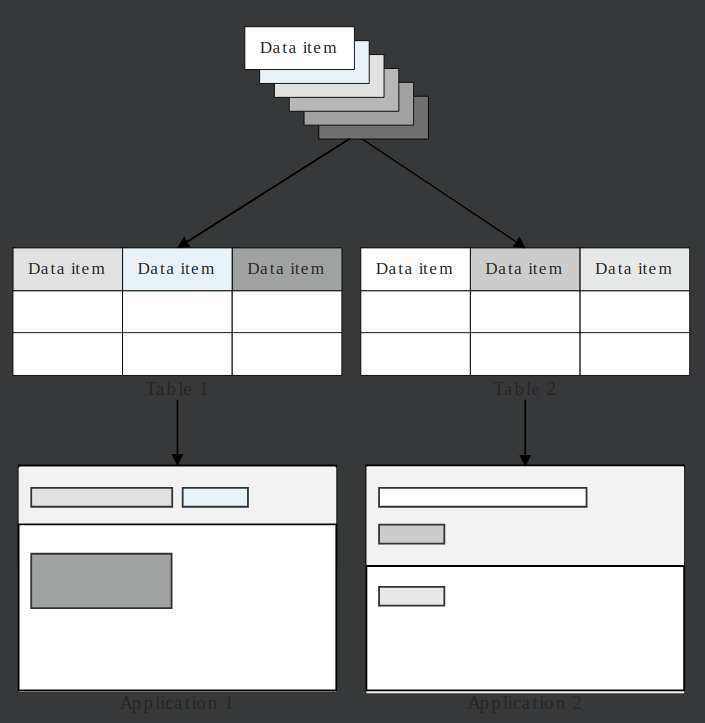

> ### HOW TO WRITE FIELD NAMES AND HELP TEXT

Follow these guidelines when creating synonyms for the data items in your applications.

When writing help text, refer to the **_NEXTWORLD STYLE GUIDE_**. In particular:

- Keep things simple. (Common words, shorter sentences.)
- Remember who your audience is and what they might be wondering about.
- Use complete sentences.
- Write to the reader, in second person. ("You"...)
- Use active voice as much as possible.

### Guidelines

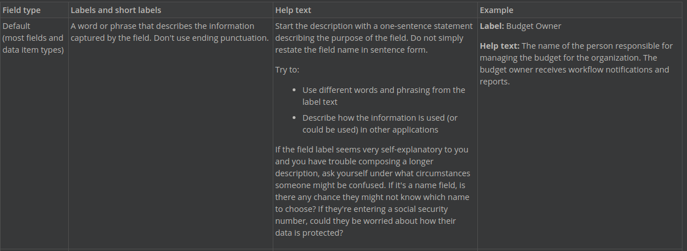

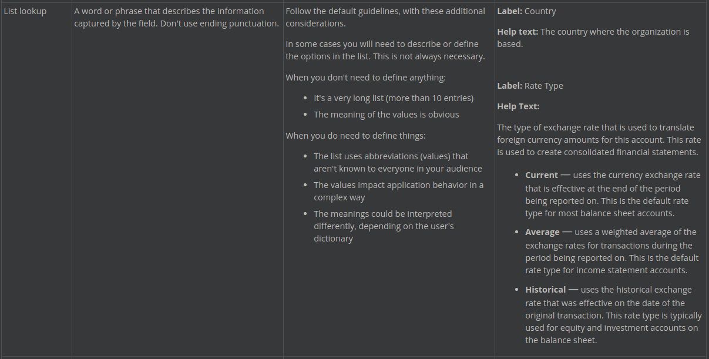

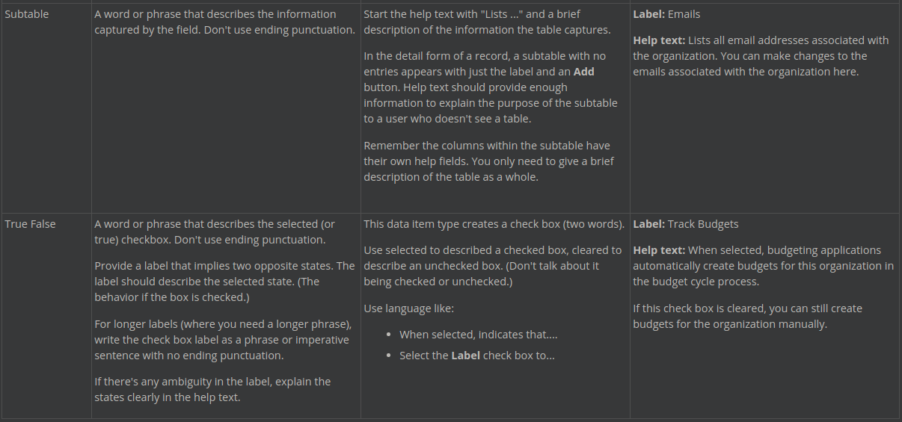

---

- [Top](#Back_To_Top)

---

## 3 CREATE DATA ITEMS

In this section you will create different types of data items in the Data Items application, configure formatting and validations, and add synonyms. In future sections, you'll add your data items to a table, and then build an application to track credit card information.

### Create a text data item

1. Using the Navigation menu, open the `Data Items` application.

This opens the list form of the application and you can see records for all existing data items.

2. Click `Create`.

This opens the detail form where you can edit new data items.

> ### When you create a new object in Nextworld, the name field contains 4-5 letters, which is the namespacing. Nextworld uses namespacing, which you cannot change or remove, to differentiate between Nextworld-created objects and user-created objects.

3. Enter the following values for the data item, where `NN` are your initials.

For example if your name is George Washington, your data item name is `GWCreditCardType`.

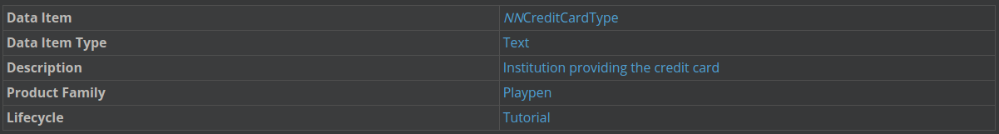

> ### The practice of adding your initials to the data item name is only applicable during the tutorials. When creating data items in the future your data items name will still need a unique name, however it won't include your initials.

4. Click the Synonyms page.

5. Click Add.

6. Enter the following information:

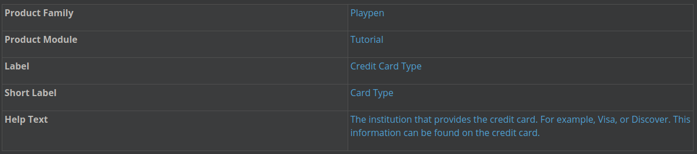

7. Click Save and Exit.

This returns you to the list form of the Data Items application.

Create a text data item with format and validation

1. Click Create.

2. Enter the following values for the data item, where NN are your initials.

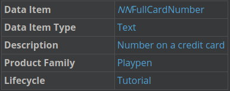

4. Click the Formatting & Validations page, and then enter the following information:

This page is where you can add specific configurations to your data items.
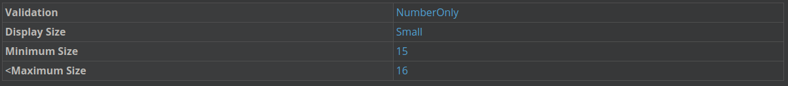

4. Click the Synonyms page, and then click Add.

> ### A synonym controls what field name and help text a user sees in an application. This allows you to reuse the same data item in multiple applications, and in multiple ways.

5. Enter the following information:

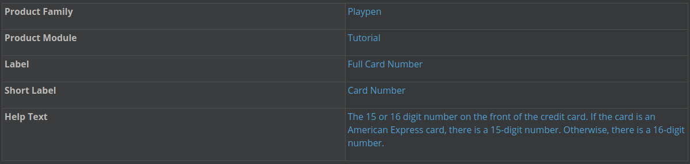

6. Click Save and Exit.

### Set field width

You can configure the display width of a field. This draws attention to important fields, maintains a well-organized layout, and controls the layout of fields.

To adjust the size of a data item, open the data item, click the Formatting & Validations page, and select the desired size in the Display Size field.

---

Below are guidelines for how many characters display for each field size in list form. Field sizes may change when switching between forms and browser window sizes.

- Tiny 2-4 characters
- Small 12-20 characters
- Medium 21-30 characters
- Large 31-45 characters
- Huge 50+ characters
- Full This is the default if a size is not selected

---

### Create more text data items

1. Create another data item using the same steps as before. Write your own help text and synonym using the guidelines in the How to write field names and help text topic.

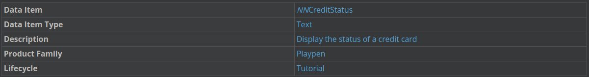

2. Click the Formatting & Validations page and enter the following information:

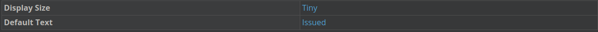

3. On the Synonyms page, add your own synonym and help text.

4. Click the drop-down menu on the save button, and then select Save and Add New.

> ### Clicking **_Save and Add New_** creates a new data item. You receive a success message after the system has saved the current data item and created a new data item.

5. Create three more text data items. Write your own synonyms and help text.

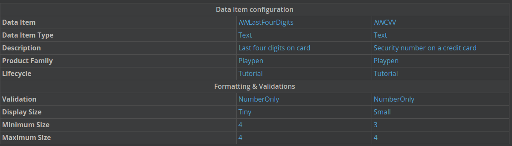

### Create currency data items

1. Create currency data items with the following information:

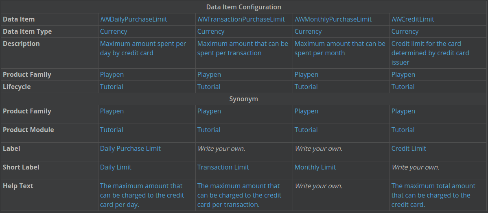

2. Click the drop-down menu on the Save button and select Save and Add New.

### Create Number Data items

1. Create number data items using the same steps as above. Write your own help text on the Synonyms page.

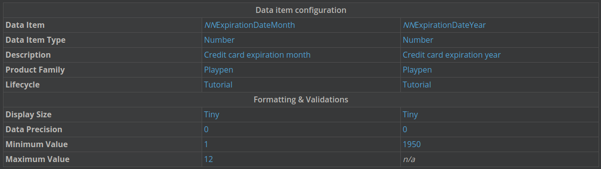

2. Click Save and Exit.

---

- [Top](#Back_To_Top)

---

## 4 UNDERSTANDING LIST LOOKUPS

List lookups result in a drop-down list of selections a user can choose from, and are best for values that are not likely to change.

For example, a list lookup is best for a list of country names because they will not change much over time.

Each list lookup is associated with a list of lookup keys. The lookup key is the definition of the items in the list.

A lookup key is a value-description pair. The keys defined for the lookup determine what a user can select in an application. The application builder determines if the value or description displays. For example, if you are working with a budgeting application and need to list your budget statuses, you can choose to display the description as `Draft` and the value as `In Process`.

To make list lookups available in an application, it is necessary to add the lookup to a text data item.

When adding a lookup key you configure the following properties:

| .                  | .                                                                                              |
| ------------------ | ---------------------------------------------------------------------------------------------- |
| Lookup Value       | Permanent, unchanging value associated with that lookup key.                                   |
| Lookup Description | Can be changed but shouldn't, can display in an application, and is an expansion of the value. |
| Lookup Icon        | Optional. Icon that accompanies the value in the application.                                  |
| Background Color   | Optional. Color that appears in the list lookup and the field in the application.              |

You can learn more in the **_LIST LOOKUPS_** topic.

> ### **_LIST LOOKUPS_**

A list lookup is created over a fixed list of values, and results in a drop-down list of selections.

This is the best type of lookup to choose when you have a stable list of values that is not likely to change significantly over time, and which stands as a simple list, not requiring related details. For example, use a list lookup to define a list of countries, payment methods, or sports team franchises. In each of these examples there is an established list of members. Although there might be some changes to list members over time, such changes are rare. The contents of the list are controlled and do not change frequently.

Members in a list are defined by value and description pairs. For example, in a list of countries, the value is a code (USA) and the description is the full country name (United States of America). Once the list is created, you can change a description or add a new value-description pair, but you should never delete a value because doing so creates problems for any records that are using that value. Instead, a value that should no longer be used can be set to inactive, which prevents it from being selected in new records, but does not alter existing records or break any legacy processes that depend on the inactive value. Inactive list lookup values are values that still available for inquiries, but cannot be used for new records.

Choose this lookup type if you have a list of options that is not expected to change frequently.

> ### You do not need to add a list lookup data item to any indexes when you are configuring a table. List lookup data items are automatically indexed when they are created.

---

- [Top](#Back_To_Top)

---

## 5 CREATE LIST LOOKUPS

In this tutorial you'll create list lookups and link them to data items you created.

### Create a list lookup

1. Open the `List Lookups` application using the Navigation menu.

2. Click `Create`.

3. Enter the following information for your lookup:

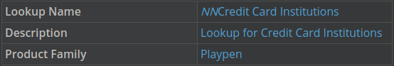

4. Select the Apply Icon and Colors check box.

This enables you to configure icons and colors for this list lookup.

### Add lookup keys

1. Click `Add`.

2. Use the following values to add lookup keys.

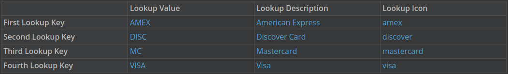

3. Click `Save and Exit` to save the lookup keys and the list lookup record.

### Link a list lookup to a data item

You need to associate your list lookup with a data item in order to access the lookup from an application.

1. Open the `Data Items` application.

2. Using the Filter Row, filter for and open the _`NNCreditCardType`_ data item.

3. Click the Formatting & Validations page.

4. Enter the name of your list lookup in the `Lookup Name` field.

5. Click `Save and Exit`.

### Create Credit Card Status list lookup

1. Open the `List Lookups` application using the Navigation menu.

2. Click `Create`.

3. Enter the following information for your lookup:

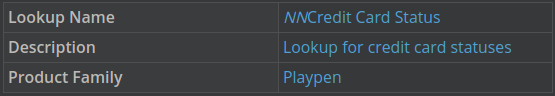

4. Select the `Apply Icon and Colors` check box.

Add lookup keys

1. Click `Add`.

2. Use the following values to add lookup keys.

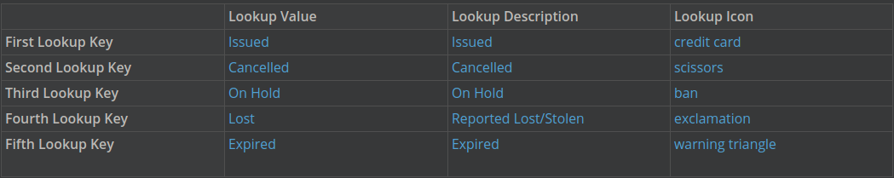

3. Click `Save and Exit` to save the lookup keys and the list lookup record.

### Link a list lookup to a data item

1. Open the `Data Items` application.

2. Using the Filter Row, filter for and open the _`NNCreditStatus`_ data item.

3. Click the Formatting & Validations page.

4. Type the name of your list lookup in the `Lookup Name` field.

5. Click `Save and Exit`.

---

- [Top](#Back_To_Top)

---
