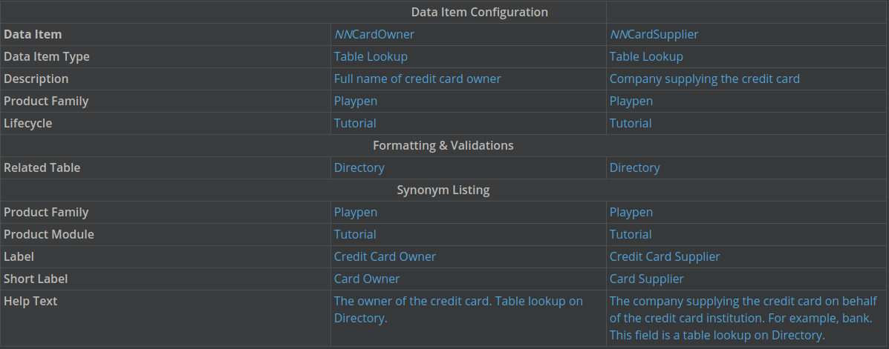
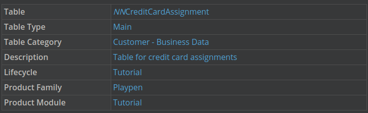
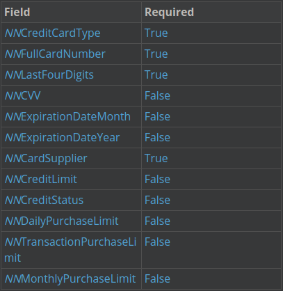

---
 Top
---

- ### [1 UNDERSTANDING TABLE LOOKUPS](#1_UNDERSTANDING_TABLE_LOOKUPS)
- ### [2 NEXTWORLD EXAMPLE: TABLE LOOKUP](#2_NEXTWORLD_EXAMPLE_TABLE_LOOKUP)
- ### [3 CREATE TABLE LOOKUPS](#3_CREATE_TABLE_LOOKUPS)
- ### [4 UNDERSTANDING TABLES](#4_UNDERSTANDING_TABLES)
- ### [5 CREATE A TABLE](#5_CREATE_A_TABLE)

---

## 1 UNDERSTANDING TABLE LOOKUPS

Understanding table lookups
You can use a table lookup to populate the fields of an application with validated information that is stored in another table. You define the source table when you create a table lookup data item.

Use a table lookup to retrieve and show information that's stored in a different table. This differs from a list lookup, which provides a list of predetermined values. Table lookups provide a way to access an unlimited number of fields from another table.

A table lookup keeps information consistent across multiple sources with quick and easy updating, and reusable data.

In a table lookup, the lookup uses the nwId (not the name) to reference the item (field value) it looks up. This maintains the relationship, even if the referenced value changes. Storing the nwId rather than the name is a layer of data validation that removes the possibility of the incorrect information being passed.

Learn more about what a nwId is in the **_nwId_** topic (**_NWID_**).

[Table Lookups -> nwId](https://github.com/WNortier/nextworld/blob/master/nextworld-platform-tutorials/01-build-an-application/00-build-an-application-overview.md#3_TABLE_LOOKUPS)

For example, a company might keep a table that is a `ChartofAccounts`, where each account has a name, a number, date opened, and a description. New accounts are added, and inactive accounts are marked as such. A second table, `BankDeposits`, is used to record account deposits, and each deposit is linked to an account.

The `BankDeposits` application is designed to use a table lookup to retrieve the correct account records from the `ChartofAccounts` application, ensuring that all bank deposits are associated with an account. The other data items in the `ChartofAccounts` are also marked for lookups, and this allows the `BankDeposits` application to also display the account name and account information associated with the bank account.

With the table lookup you'll always see the current information for the account. If the account name has changed since the record was created, you'll see the new name.

Learn more in the **_TABLE LOOKUP_** topic.

[Table Lookups](https://github.com/WNortier/nextworld/blob/master/nextworld-platform-tutorials/01-build-an-application/00-build-an-application-overview.md#3_TABLE_LOOKUPS)

---

- [Top](#Back_To_Top)

---

## 2 NEXTWORLD EXAMPLE: TABLE LOOKUP

The Payee and Pay From Account table lookups in the Payments application are helpful examples of table lookups because once a value is selected in the table lookup field, related fields are populated in the form. When you enter a value in the Contact field, logic runs that populates the Pay To The Order Of, and changes the currency in the Amount To Pay field. When you enter a value in the Bank Account field, logic runs that populates the Account Name field, and fetches detail records of any applied payments.

### Object overview

The Payee table lookup is used in the Payments application to search the Directory. The Payee table lookup looks up on the Name field, in the directory. The Pay From Account table lookup is used to search the Chart of Accounts. The Pay From Account table lookup looks up on the AccountNumber field, in the Chart of Accounts.

### Configuration elements

The Contact data item is of type table lookup, and Directory is the related table. The Contact data item is a field in the Payments table.

The BankAccount data item is of type table lookup, and ChartOfAccounts is the related table. The BankAccount data item is a field in the Payments table. AccountName is a secondary table lookup field that populates based on the value in the Bank Account field.

| Object      | Object Type  | Example Context                         |
| ----------- | ------------ | --------------------------------------- |
| Contact     | Table Lookup | Payments application Contact field      |
| BankAccount | Table Lookup | Payments application Bank Account field |

## 3 CREATE TABLE LOOKUPS

In this section, you'll create table lookup data items that look up on the Directory table. In future sections you'll add these data items to a table, and then build an application to track credit card information.

### Create a data item

1. Open the `Data Items` application.

2. Create two new data items with the following values:

The `Related Table` field specifies what table the lookup displays values from.

3. Click Save and Exit.

---

- [Top](#Back_To_Top)

---

## 4 UNDERSTANDING TABLES

A _table_ is a collection of data items, organized into columns. Each data item represents a column in the table. A table is the information foundation for an application.

A data item becomes a field when it is used in an application.

When creating a table you configure the following properties:

| .              | .                                                                                                                                |
| -------------- | -------------------------------------------------------------------------------------------------------------------------------- |
| Table          | Internal name that is only seen by other developers and does not show in the end users's application.                            |
|                | This is the unique universal name of the table that you see no matter where you access the table.                                |
| Table Type     | Defines how a table can be used and what kind of application can be built on the table.                                          |
| Table Category | Defines who can use the table and where the table is stored.                                                                     |
| Description    | Internal description for the table. It helps other developers understand what the table was created for and what it is used for. |
| Lifecycle      | Where a table is created and stored. A table cannot be used across lifecycles.                                                   |
| Product Family | What family the table belongs to and can be used by.                                                                             |
| Product Module | What module the table is used in.                                                                                                |
| Specification  | Technical description of the table for application builders.                                                                     |

Learn more in the **_TABLES_** topic.

[Tables](https://github.com/WNortier/nextworld/blob/master/nextworld-platform-tutorials/01-build-an-application/00-build-an-application-overview.md#2_TABLES)

---

- [Top](#Back_To_Top)

---

## 5 CREATE A TABLE

In this section, you'll create a table using data items you created in previous sections. You'll configure specific fields as required. In later sections, you'll build an application using this tutorial to track credit card information.

### Create a table

1. Open the `Tables` application.

2. Click `Create`.

3. Enter the following values for the table, where **_`NN`_** are your initials, and then click `Save and Stay`.

> ### There are various table types in the Nextworld environment. What table type you use depends on what you need to do. You can learn more in the **_TABLE TYPES_** topic.

[Tables -> Table Types](https://github.com/WNortier/nextworld/blob/master/nextworld-platform-tutorials/01-build-an-application/00-build-an-application-overview.md#2_TABLES)

### Add data items to the table

1. Click the Fields page, and then click `Add`.

2. Enter the name of your data item, **_`NNCardOwner`_**, and then, using the table lookup drop-down, select the name to add the data item.

> ### When searching for a data item you've created, you must include the namespace. For example if your data item is named `GWDateCreated`, and the namespacing is `nsTut`, you’ll type `nsTutGWDateCreated` when adding your data item to the table

4. Select the Required check box to make this field required in the application.

> ### In an application, a required field must have a value entered before the record can be saved. This means that a user cannot save a record in an application without entering a value into a required field.

5. Add your other data items using the following values:

6. Click `Save and Exit`.

---

- [Top](#Back_To_Top)

---
