---
 Top
---

- ### [1 UNDERSTANDING APPLICATIONS](#1_UNDERSTANDING_APPLICATIONS)
- ### [2 FIELD PLACEMENT](#2_FIELD_PLACEMENT)
- ### [3 BUILD THE CREDIT CARD ASSIGNMENT APPLICATION](#3_BUILD_THE_CREDIT_CARD_ASSIGNMENT_APPLICATION)
- ### [4 UNDERSTANDING APPLICATION SETTINGS](#4_UNDERSTANDING_APPLICATION_SETTINGS)
- ### [5 CREATE AN APPLICATION](#5_CREATE_AN_APPLICATION)
- ### [6 UNDERSTANDING MENUS](#6_UNDERSTANDING_MENUS)
- ### [7 CREATE MENU ENTRIES](#7_CREATE_MENU_ENTRIES)
- ### [8 CHECKPOINT](#8_CHECKPOINT)
- ### [9 NEXTWORLD EXAMPLE CustomerFields DATA ITEM GROUP](#9_NEXTWORLD_EXAMPLE_CustomerFields_DATA_ITEM_GROUP)
- ### [10 NEXTWORLD EXAMPLE GLRestrictions SUBTABLE](#10_NEXTWORLD_EXAMPLE_GLRestrictions_SUBTABLE)

---

## 1 UNDERSTANDING APPLICATIONS

An _application_ is a way to add, edit, review, and manipulate records. An application displays table information.

Applications are built on tables, and data items in the table are available in the application as fields.

When building an application you configure the following properties:

| .                 | .                                                                                                                                               |
| ----------------- | ----------------------------------------------------------------------------------------------------------------------------------------------- |
| Application Name  | Internal name for the application. This name must be unique.                                                                                    |
| Application Type  | Defines what the application does and how it works.                                                                                             |
| Application Style | Controls how the application can be used and how it appears.                                                                                    |
| Description       | Internal description for the application that helps other developers understand what the application was created for and how it should be used. |
| Lifecycle         | Where an application is created and stored. An application cannot be used across lifecycles.                                                    |
| Table             | Configures what table the application is built on.                                                                                              |
| Product Family    | What family the application belongs to and is used by.                                                                                          |
| Product Module    | What module the application can be used in.                                                                                                     |
| Specification     | Technical description of the application for application builders.                                                                              |

Learn more in the **_APPLICATIONS_** topic.

[Applications](https://github.com/WNortier/nextworld/blob/master/nextworld-platform-tutorials/01-build-an-application/00-build-an-application-overview.md#4_APPLICATIONS)

---

- [Top](#Back_To_Top)

---

## 2 FIELD PLACEMENT

You can group fields in an application into different areas using rows, columns, and pages to help organize information.

When you have a complex application with a lot of fields, putting time and thought into the layout of information helps make it easier for the user. Think of the application screen as a grid, where each space is defined by a row and a column.

To configure where it appears in a grid, add a row and column to a field. The row controls the tabbing left to right through fields. The column aligns fields across rows. When you add more than one field to a column in the same row, you will tab down each column before tabbing to the right.

To organize your fields, you assign a row to a field, and then assign a page to the row. You can divide fields into pages to show smaller groups of fields. You can assign rows as header rows, which always display at the top of an application, no matter what page is open.

## 3 BUILD THE CREDIT CARD ASSIGNMENT APPLICATION

In this tutorial, you'll use the data items you made and the table you created to build an application. You'll configure the display and layout of the fields. Then you'll launch your application and create an application record.

### Build an application on your table

1. Use the navigation menu to open `Applications`.

2. Click `Create`.

3. Enter the following values for the application:

> ### The first five fields you enter a value for are in the top pane, or header row, and the rest are in the application definition pane on the General Configuration page. Note that not all fields available are required, and you won't be using them.

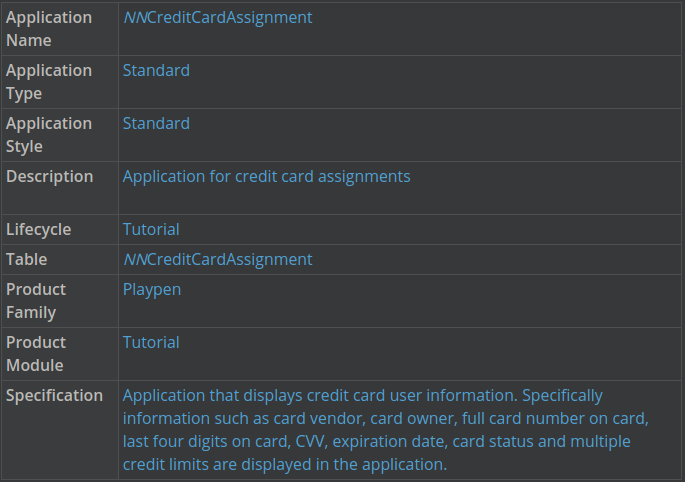

> ### The application specification provides information about the application that is more technical, to be used by the application builder. The specification also provides the purpose of the application.

Configure list form and detail form fields

You should still have your **_`NNCreditCardAssignment`_** application open for editing.

1. Click the List Form Fields page.

2. Make the following fields visible in the list form by changing the display for each field from Excluded to Primary.

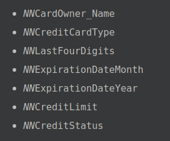

This determines what fields appear in the list form when you open the application.

> ### The data items you use for this application are only a few of the data items available in the configuration of this application. A quick way to locate the data item you need is to use the filter row.

Because you added the **_`NNCardOwner`_** and **_`NNCardSupplier`_** table lookup data items to your table, some of the fields you see here are from the Directory table that the **_`NNCardOwner`_** and **_`NNCardSupplier`_** data items are lookups to. These fields are all disabled by default.

> ### The "\_NNCardOwner\_\_" portion of the field name tells you what table lookup is pulling the fields, and the second half of the name is the field name. For example, for "_NNCardOwner_Name_" Name is the data item name in the `Directory` table.

3. Make the following fields visible in the expansion row in the list form by changing the display for each field from `Excluded` to `Expansion`.

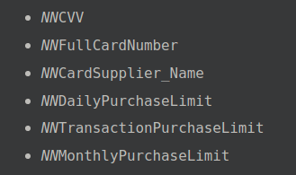

4. Click the Detail Form Fields page.

5. Configure the detail form with the following information.

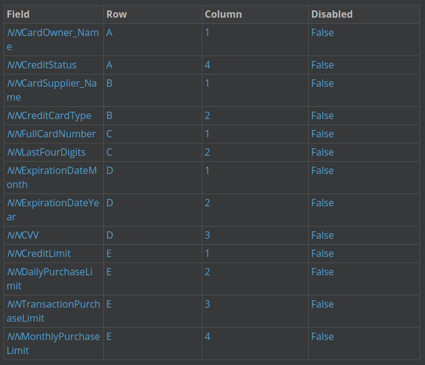

> ### When you make updates to your application you need to manually save your changes before navigating away from the detail form of a record. The only way to save your changes is to click the Save button.

> ### You must always manually save your changes before navigating away from your work. There is **no** automatic save, so the only way to save your changes is to click the `Save` button before moving on to another task.

Configure pages and rows

You should still have your **_`NNCreditCardAssignment_`** application open for editing.

1. Open the Pages and Rows page.

2. Enter row **_`A`_** in the `Header Row` and the `Header Row To` fields.

3. Click `Add`, and then enter **_`A`_** in the `Page` field and `Card Information` in the `Title` field.

4. Add a page **_`B`_**, and enter `Purchase Restriction` as the `Title`.

5. Using the `Add` button below Rows, configure the following information:

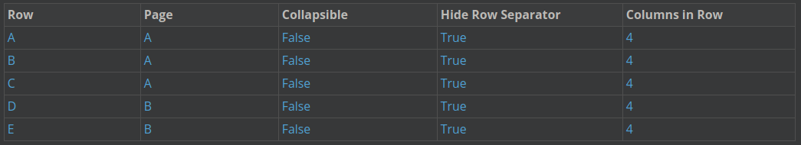

> ### When you add rows to pages you enter the page name exactly as it appears in the `Page` field. This means that if the namespacing is `NsTut`, and your page name is `A`, you would enter `NsTutA` in the Page field.

6. Click `Save and Exit`.

Generate your application

1. Filter for your application (in `Applications`).

2. Click the Row Actions menu, and then select `Generate`.

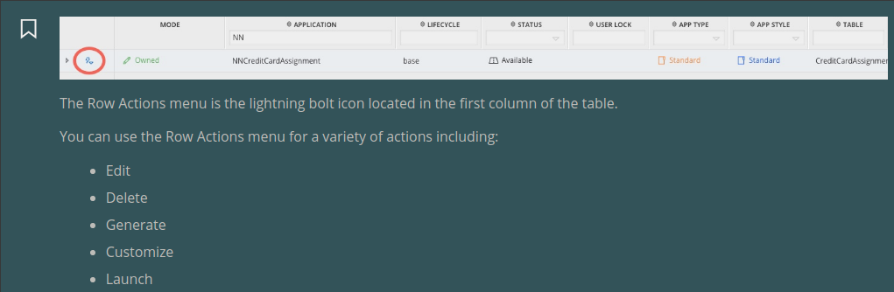

3. Open your notifications to view your success message.

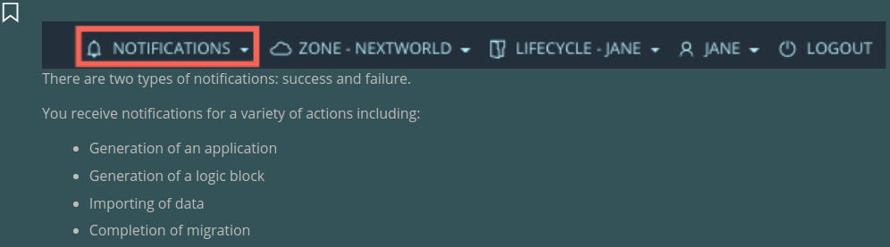

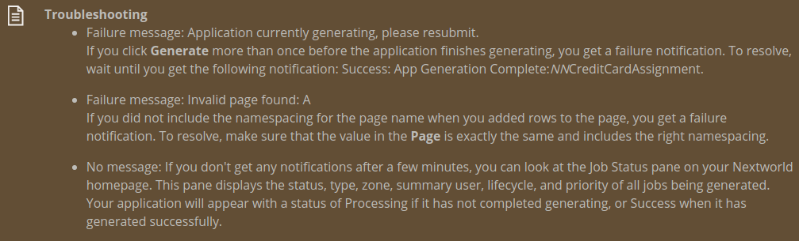

Launch your application

1. In `Applications`, filter for your **_`NNCreditCardAssignment`_** application.

2. Click the Actions menu, and then click `Launch` to open and begin using your application.

Add a record to your application

In your application a new contact is a new record. In this section, you can add records to your `Credit Card Assignment` application.

1. Click `Create`.

This opens a new record in detail form.

2. Enter information each of the fields, and then save.

---

- [Top](#Back_To_Top)

---

## 4 UNDERSTANDING APPLICATION SETTINGS

Application settings add a final layer of customization to applications, so you can create different flavors for different audiences. This means that you can give different users different experiences with the application based on their role.

Use application settings to configure a new flavor of an application, without changing the configuration of the application. Application settings make Nextworld applications reusable because you can repurpose an application, giving it a new name, new aim, new use and new audience. Application settings are a layer of configuration that can be applied by application developers, or by Nextworld users.

You can use application settings for:

- #### Fields
  - Create data mappings such as default and filter values when creating or opening a record
- #### Layout
  - Hide or disable a row or page
  - Collapse a row
  - Hide or disable a field
- #### Actions
  - Hide or disable an action such as a row or form action
- #### Header/Detail Applications

  - Input the individual Header and Detail application settings in a Header / Detail application setting

Learn more in the **_APPLICATION SETTINGS_** topic.

You configure the following when creating an application setting:

| .                        | .                                                                                                                                                                              |
| ------------------------ | ------------------------------------------------------------------------------------------------------------------------------------------------------------------------------ |
| Application Setting Name | The unique name of the application setting. Typically, an application will have more than one named setting, so the name should reflect the purpose of the setting.            |
| Setting Menu Title       | The name of the setting that will display on the Navigation menu under the application. This can further describe how a setting affects how a user experiences an application. |
| Application Name         | The name of the application you are configuring the setting for. This is a lookup field.                                                                                       |
| Customization Pattern    | The customization pattern for the application setting that defines what changes, or customizations, can be made to the application setting.                                    |
| Entry Point              | The form the application opens. For example, detail form or list form                                                                                                          |

When you configure data mappings in an application setting, you use the Data Mapper component. Learn more about it in the **_DATA MAPPER COMPONENT_** topic.

> ### **_APPLICATION SETTINGS_**

Application settings allow you to create different application flavors for different audiences. This means that you can give different users different experiences with the application based on their role.

You can create application settings in the **Application Settings** application.

Application settings allow you to control specific aspects of how an application is displayed. For instance, use application settings to map data so that applications contain default values when you open them, hide and disable individual objects, such as fields, in the application, hide and disable control actions in the application, and input the Header and any Detail application settings for Header / Detail application settings.

Application settings change the composition of an application for the user's point of access. For example, accounting staff use the **Customer Invoices** application to complete different tasks than accounting managers. For example, accounting staff use customer billing information, while accounting managers use payment information to update account information.

Using application settings, the result would be **Customer Invoices for Billing**, for accounting staff to use. This application would be read-only, as account staff would only need to retrieve information but not change any information. The other application setting would result in **Customer Invoice Payment Information** for accounting managers to use. This application would have the `Create` button disabled, as accounting staff would not be creating new invoices.

The diagram below illustrates an application that has multiple application settings applied for different user roles.

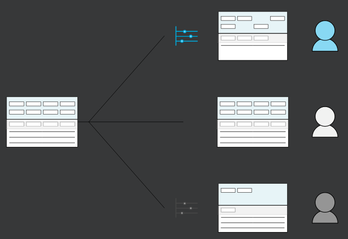

> ### Application settings are a way to customize the user experience of an application. Do not use application settings to change the design, or logic, of an application. That is, do not use an application setting to do anything a user should not undo.

> ### For example, let's say you create a directory application that uses a contact role grouping field. This field is used to group users based on their role within the directory. The value is populated by a logic block based on the value in the Contact Role field. You don't want users to enter any values into the field, or change the value once it is populated. While you could use an application setting to hide this field or a logic block to disable it when a value is added, it would be better to hide it in the application configuration. This is because the field could be confusing to users, and you want it to always be hidden. Because users cannot change the display of existing fields in applications, this configuration prevents the confusion a user seeing a field that they cannot change, and that they do not use.

### Sequence

In addition to using application settings, there are a few more things that control the application behavior. Because of this, configuration settings are applied in a sequence. The final item in the sequence takes precedence over all previous settings. When applying a default value, the sequence is:

1. Data item configuration
2. Application settings
3. Field mapping
4. Logic blocks

For example, if an application setting defaults a value into a field, then a field mapping defaults a different value, the value from the field mapping would persist. Then, if a logic block changes the value of that field, the value from the logic block takes precedence over all previous values.

When applying a default value into a filter, the data item configuration is not considered in the sequence.

> ### **_DATA MAPPER COMPONENT_**

Use the **Data Mapper** tool to identify source data and link, or map, it to a destination target.

The **Data Mapper** tool is available in multiple locations within Nextworld, including the **Application Links**, **Search Actions**, and **Composite Application Links** sub-tables in the **Applications** application.

The tool is comprised of a series of option and input fields for identifying the data you want to map and which targets you want populate. This is represented in the **Data Mapper** tool as source (left section) and destination (right section) components. The options available in the source section classify as mappable data and the options available in the destination section classify as a target location. The end result is the source data populating the target.

For example, an application setting exists over the **Apply Customer Credits** application with a data mapping definition configured. The end result of the data mapping is that when you open to the list form of the **Apply Customer Credits** application, the value `Customer Credit` automatically populates the **Receipt Type** filter field, which is the data item `CashReceiptType`.

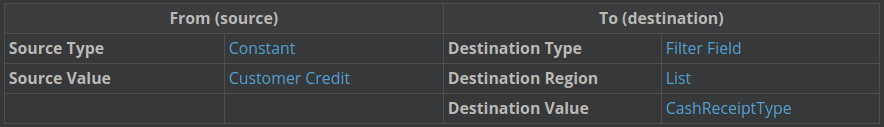

Source and destination options

All data mappings follow the same basic rule of mapping source data to a destination target. However, there are multiple ways in which you can map data because there are various combinations of source and target options that can be selected based on different situations and dependencies. Some of these options depend on where you are accessing the **Data Mapper** tool from, as well as the type and style of the source and destination applications. The options available for the source and destination value can also vary based on the the source type, destination type, or destination region selected.

---

- [Top](#Back_To_Top)

---

## 5 CREATE AN APPLICATION

In this section you'll create an application setting for your `NNCreditCardAssignment` application filters for Visa credit cards on the list form of the application. In the next section, you'll apply that application setting to a menu record.

Create an application setting

1. In **Application Settings**, click **Create**.

2. Enter the following information:

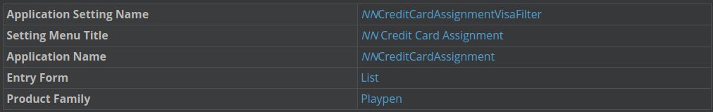

3. On the Fields page under the Data Mappings field, click Add Mapping.

> ### Because you're using a list lookup field value to filter, you must select the field you're mapping to first. After you select the `NNCreditCardType` as the destination field, you can select from the list lookup values as constants.

4. Configure the following, and then click Save and Exit.

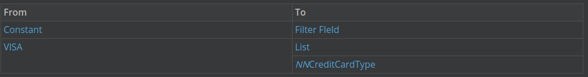

---

- [Top](#Back_To_Top)

---

## 6 UNDERSTANDING MENUS

The **Menus** application is used to manage menu entries. Menu entries are the options that display when you open the navigation menu.

Use the **Menus** application to create menu entries for applications. The **Menus** application is where you can configure:

- the name of the application in the menu
- the menu page, section, and category
- application settings applied to the application

Use the **Menus** application when you want to access a generated application through the menu.

The **Menus** application is necessary to manage menu entries because it enables the reuse of applications. You can create multiple record entries for an application, based on the **Menus** configuration. You can have the one application with multiple menu entries. For example, if you apply an application setting to the **CashReceipts** application that filters for records with a **Status** of `Unapplied`, you could make a menu entry with the title **Unapplied Cash Receipts**, in addition to the menu entry for **Cash Receipts**.

Learn more in the **_MENUS_** topic.

### **_MENUS_**

The **Menus** application is used to manage menu entries. Menu entries are the options that display when you open the navigation menu.

Use the **Menus** application to create menu entries for applications. The **Menus** application is where you can configure:

- the name of the application in the menu
- the menu page, section, and category
- application settings applied to the application

Use the **Menus** application when you want to access a generated application through the menu. However, not all generated applications need menu entries. For example, a mini app that is connected to a search action would not need its own menu entry. Because you access the application through a search action, you wouldn't need to open it from the menu.

The **Menus** application is necessary to manage menu entries because it enables the reuse of applications. You can create multiple record entries for an application, based on the Menus configuration. You can have the one application with multiple menu entries. For example, if you apply an application setting to the **Attendance** application, making it read only, you could make a menu entry under the title **View Attendance**, in addition to the menu entry for **Attendance**.

Additional configuration settings

In addition to application settings, other configuration settings determine how the application will display when opened. When an application is opened from the menu, configuration settings are applied to the application the following sequence:

1. Application Building Configuration
2. Field mapping
3. Application Settings
4. Logic Blocks

---

- [Top](#Back_To_Top)

---

## 7 CREATE MENU ENTRIES

In this section, you'll create a menu entry for your **NNCreditCardAssignment** application. Then you'll create a second menu entry that applies your `NNCreditCardAssignmentVisaFilter` application setting when you open your **NNCreditCardAssignment** application from the menu.

Create a menu entry

1. In **Menus**, click the `Create` button.

2. Enter the following information for your new record to configure your menu entry:

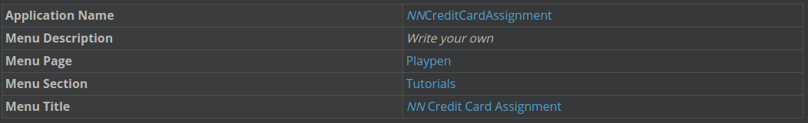

3. Click `Save and Add New`.

### Create a menu entry with an application setting

1. Enter the following information:

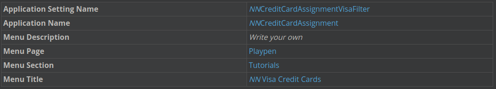

2. Click`Save and Exit`.

### Open your application from the menu

1. Open the navigation menu, and then search for your `NN Credit Card Assignment` menu entry.

2. Launch your application by clicking on the menu entry.

### Open your application with an application setting

1. Open the navigation menu, and then search for your `NN Visa Credit Cards` menu entry.

2. Launch your application by clicking on the menu entry.

Note that a filter is applied to the list form of your application when you open it that filters the **Card Type** filter field for `Visa`.

---

- [Top](#Back_To_Top)

---

## 8 CHECKPOINT

You created different data item types, list lookups, and table lookups. Then you used them to create a table. You built an application, and then configured pages in your application, assigning rows, columns, and pages to fields. You used your application to create a record, verifying that all fields were configured correctly.

Be able to do the following:

- Create different types of data items
  - Text
  - Number
  - Currency
- Understand the connection between a data item and its synonyms
- Configure data item formatting and validations
- Save and add a new data item
- Open a data item
- Create a list lookup
- Define lookup values
- Link a list lookup with a data item
- Create a table lookup data item
- Create a table
- Add fields to a table
- Build an application
- Configure list and detail form fields
- Assign a row and column to a field
- Add pages to an application
- Generate an application
- Create an application setting to filter the list form
- Create a menu record and apply an application setting
- Open an application from the menu
- Add a record to an application

---

- [Top](#Back_To_Top)

---

## 9 NEXTWORLD EXAMPLE: CustomerFields DATA ITEM GROUP

The `CustomerFields` data item group is a helpful example of data item groups because you can see how when you add a data item configured as a data item group to a table, you can configure all of the fields in the application. In other words, by adding one data item to a table, you can add multiple fields to an application.

### Object overview

The `CustomerFields` data item group is used in the **Directory** application to organize related data items used to store customer information. The table for the data item group is named `CustomerFields`. The data items in the data item group are:

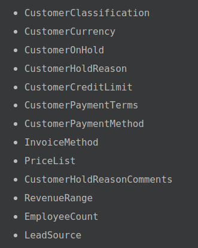

### Configuration elements

The `CustomerFields` data item group is used in the **Directory** application to organize customer fields. The `Directory` table and application follow the best practice of organizing related fields together. They both group the fields from `CustomerFields` together.

---

- [Top](#Back_To_Top)

---

## 10 NEXTWORLD EXAMPLE: GLRestrictions SUBTABLE

The `GLRestrictions` subtable is a helpful example of subtables because you can see how the related fields, **Name** and the **Include Children** check box are organized together in the application.

### Object overview

The `GLRestrictions` subtable is used in the **ChartOfAccounts** application to organize information about restrictions for an account.

### Configuration elements

The GLRestrictions subtable is configured as a table of type main, and has a data item of type subtable with the same name. The GLRestrictions data item is a field in the ChartOfAccounts table.

---

- [Top](#Back_To_Top)

---
