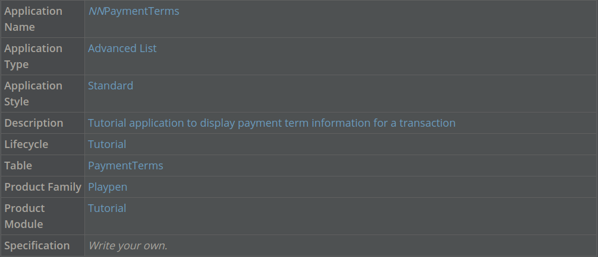
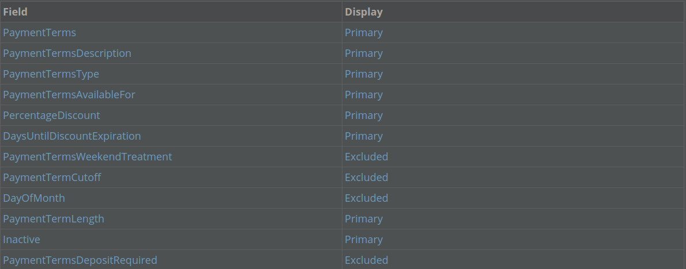
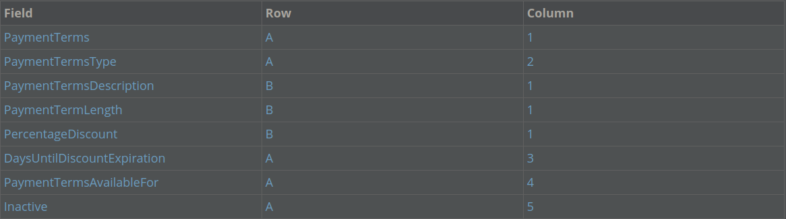

The advanced list application type supports independently maintained records. Depending on how the application is configured, this application type can also allow you to filter and edit records from the list form of the application. This allows you to easily make changes to multiple records from one page.

In an advanced list application, the initial application form is the list form, which can be configured to include an advanced filter header. From there, you can open a record in the detail form and see additional fields related to the selected record.

You define a header row for an advanced list application just as you do for a standard application. The header in an advanced list application filters records by common values. As a result, the header field can only contain fields that you can use a filter on. For example, in the **Directory** application, if you are searching for a specific contact, you could filter on the **Name** field. If you are searching for a group of contacts, you could filter on the **Contact Type** field.

For example, you could use an advanced list application, **ItemCosts**, to track item costs because you expect users to add records with basic information that don't require the user to open the detail form. Also, you expect users to edit multiple records at a time. You would configure the item name in the header row (because you know every record has an item name). When the end user opens the application, they see the item name, description, cost level, and org unit for each record, with each field being a column in the list form. You can add a new record for new items, and open the detail form of an item to see other details such as cost.

You also configure a detail form for records in an advanced list application. Just like a standard application you configure rows, columns, and pages for this form in **Applications**.

Learn more about configuration in the **_ADVANCED LIST_** topic.

> ### Not all data items are supported by the advanced list header row.

**_ADVANCED LIST_**

The Advanced list application type enables an editable list form and a header with fields for the quick filtering of records. This application type is useful for quickly adding and editing multiple records.

When an advanced list application includes a header row, that row is used on the list form of the application to provide a set of filters. For this reason, the header row of an advanced list application should only include data items that are valid for sorting. These are generally data items that share a common value across multiple records. For example, in a company directory, you might want to sort by location or department.

 Top

---

- ### [1 BUILD AN ADVANCED LIST APPLICATION](#1_BUILD_AN_ADVANCED_LIST_APPLICATION)
- ### [2 NEXTWORLD EXAMPLE CreditCardImportView ADVANCED LIST APPLICATION](#2_NEXTWORLD_EXAMPLE_CreditCardImportView_ADVANCED_LIST_APPLICATION)
- ### [3 CHECKPOINT](#3_CHECKPOINT)

---

## 1 BUILD AN ADVANCED LIST APPLICATION

In this tutorial, you'll build a new application over the PaymentTerms table. The application you'll build is an advanced list application to display payment terms.

### Create an advanced list application

1. From the Navigation menu, open Applications.

2. Click Create.

This creates a new application.

3. Enter the following information for your new application:

### Configure fields layout

1. Click the List Form Fields page, and configure the following display:

2. Click the Detail Form Fields page, and configure the following:

3. On the Pages and Rows page, click the Add button under the Rows field to add rows A and B.

4. Enter row A in the Header Row field.

This sets row A as the header row.

5. Save and generate the application.

### Test your application

1. From Applications, use the Actions menu to launch your application.

You can see the header row contains all the fields you assigned to row A.

2. Click Add Record.

Use the Add Record button that appears at the bottom of the list to add a new record from the list form. This adds a new, blank record record to the list. You can enter details from the list form, without opening the detail form of the application.

3. Enter information in the fields, and then click out of the row, or click the green check mark to save the record.

> ### Open the detail form of a record in an Advanced List application by opening the Row Actions menu and clicking Edit.

---

- [Top](#Back_To_Top)

---

## 2 NEXTWORLD EXAMPLE CreditCardImportView ADVANCED LIST APPLICATION

The **CreditCardImportView** application is a helpful example of an advanced list application because you can see how records are easily filtered using the header row, and easily added from the list form.

### Object overview

The **CreditCardImportView** application is used to view imported credit card transactions. Users can also process transactions in this application.

### Configuration elements

The **CreditCardImportView** application is built over the `CreditCardStatementImport` table. The header row is row A.

The fields in the header row are:

- **Run Number**
- **Integration Status**
- **Card Number**
- **Status**

---

- [Top](#Back_To_Top)

---

## 3 CHECKPOINT

You built an advanced list application over the PaymentTerms table.

Be able to do the following:

- Configure the header row of an advanced list application
- Add records to an advanced list application
- Open the detail form of an advanced list application record.

---

- [Top](#Back_To_Top)

---
