# Header detail

The header detail application supports a one-to-many relationship, where a record header may have multiple line item records associated with it. That is, the information in the header applies to every detail record.

When you build a header detail application, you work with different applications and the tables they are built over: the header detail application that you are building, the header application, and one or more detail applications. If you create detail records outside of the header detail application, they are not linked to the header. This means that if you create records in an application built over a detail table, they do not display in the header detail application.

Records in a header detail application are related, but don't need to contain the same kind of information. For example, in the **Expense Report** application, users could have multiple charges associated with a single report. The header portion of each record identifies the expense report, including details such as its date, the individual submitting it, a department code, and so forth. The detail portion would include the itemized list of expenses submitted with the expense report. There could be multiple expenses on a single report, each with its own amount, transaction date, and description.

A header detail application opens with a list form view, from which you can see all the header records in the application. When there are multiple detail applications, each displays on a separate page. The header application, which is also configured separately, displays as the header region in the generated header detail application. The header and detail applications cannot be launched individually, and can only be accessed through the header detail application.

You can learn more about configuration in the **_HEADER DETAIL_** topic.

---

##  Top

- ### [1 BUILD A HEADER DETAIL APPLICATION](#1_BUILD_A_HEADER_DETAIL_APPLICATION)
- ### [2 NEXTWORLD EXAMPLE CustomerInvoice `HEADER DETAIL` APPLICATION](#2_NEXTWORLD_EXAMPLE_CustomerInvoice_`HEADER_DETAIL`_APPLICATION)
- ### [3 CHECKPOINT](#3_CHECKPOINT)

---

## 1 BUILD A HEADER DETAIL APPLICATION

In this section, you'll use existing data items to build three tables. Then you'll build applications over those tables, resulting in a header detail application. This application is a simplified version of the Nextworld **JournalEntry** application.

### Create a detail table

These table fields display in the header detail application. The layout and display of these fields is configured in the detail application.

The data items that you use in this tutorial are base objects, so you don't need to create any data items.

1. In the `Tables` application, create a new table with the information below.

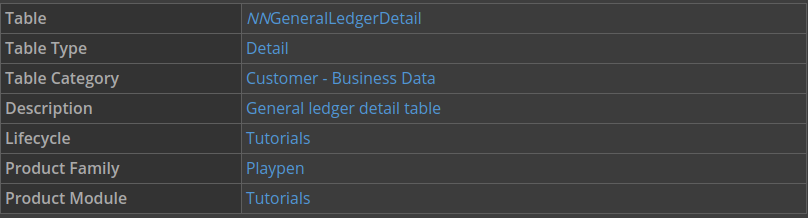

2. Open the Fields page, and then add the following fields:

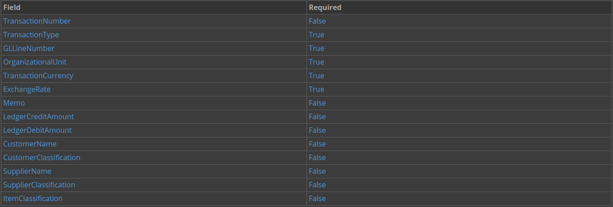

3. Click `Save and Exit`.

### Create a header table

The following table fields display in the header detail application. The layout and display of these fields is configured in the header detail application.

1. Create a new table with the following information:

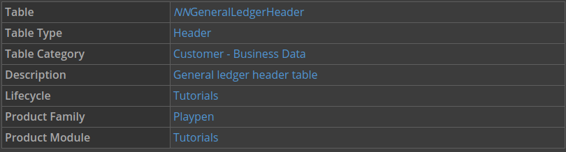

2. Open the Fields page, and add the following fields to your table:

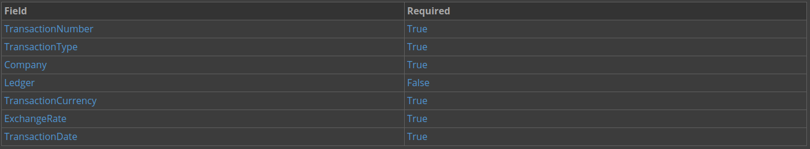

3. Click `Save and Exit`.

### Create a header detail table

The header detail table is what creates the connection between the header table and the detail table that you made.

1. Create a new table with the following information:

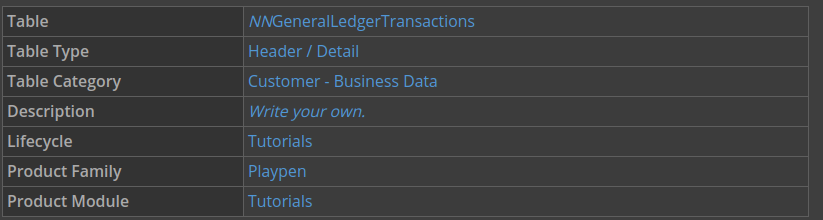

2. Open the Header / Detail page.

3. Define your header and detail tables, using the **Header Table** and **Detail Table** fields as follows:

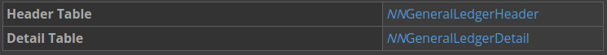

4. Configure the following common fields:

> ### Common fields are data items that are used in both the header and the detail tables that share values. You can learn more in the Common Fields topic.

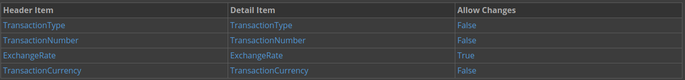

5. Click `Save and Exit`.

### Build a detail application

This application will be used in the header detail application. The records created for this application will be tied to the records in the header, and the page design configured here will be used in the generated header detail application.

1. From the Navigation menu, open `Applications`.

2. Create a new application with the following information:

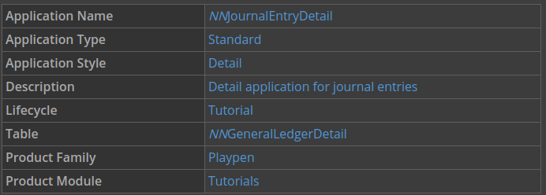

3. Configure the List Form Fields page with the following information:

> ### The data items you use for this application are only a few of the data items available in the configuration of this application. A quick way to locate the data item you need is to use the filter row.

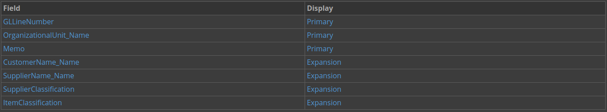

4. Configure the Detail Form Fields page with the following information:

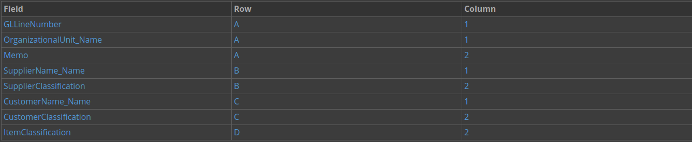

5. Save and generate your application.

### Build a header detail application

Instead of building a header application, you build an application of type header detail, and define a detail application. This definition of a detail application means that instead of displaying fields in the detail of the generated application, the detail application displays. How the header of the generated application displays is configured in the steps below.

1. From the Navigation menu, open `Applications`.

2. Create a new application with the following information:

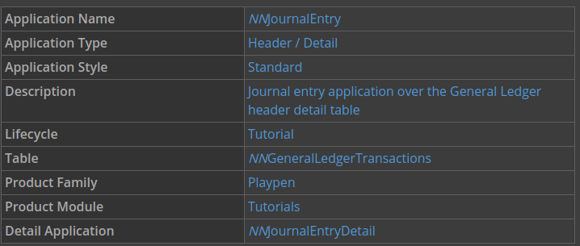

3. Configure the List Form Fields page with the following information:

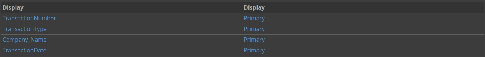

4. Configure the Detail Form Fields page with the following information:

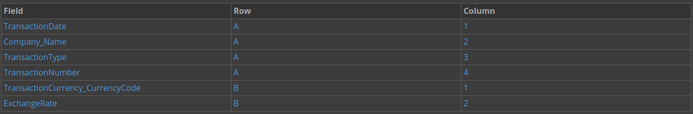

5. Save and generate your application.

### Test your header detail application

1. Launch your application.

This is the list form, which displays the header application you built.

2. Use the Create button to enter a new header detail record, and then click `Save and Exit`.

This is the header detail form.

If you create detail records outside of the header detail application, they are not linked to the header. For example, if you create records in the **NNGeneralLedgerDetail** application, they will not display in the header detail application.

4. Open the record you just created, and then edit a detail record using the Actions menu.

This is the detail form, which displays the detail application you built.

5. Save the record.

---

- [Top](#Back_To_Top)

---

## 2 NEXTWORLD EXAMPLE CustomerInvoice `HEADER DETAIL` APPLICATION

The **CustomerInvoice** application is a helpful example of header detail applications because the application illustrates how a single header record applies to multiple detail records.

### Object overview

This application allows a user to create customer invoices. Invoices can be created manually by a user in this application or through the `WriteReceivableTransactions` logic block. This application is built over the same table as the **CustomerCredit** application.

Configuration elements

The **CustomerInvoice** application is built over the `ReceivableTransactions` table, which is a header detail table. The header table is the `ReceivablesHeader` table, and the detail table is the `ReceivablesDetail` table.

The following data items are defined as common fields in the `ReceivableTransactions` table:

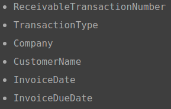

The detail application is **ReceivablesDetail**, which is built over the `ReceivablesDetail` table.

---

- [Top](#Back_To_Top)

---

## 3 CHECKPOINT

You used existing data items to create a header table, a detail table, and a header detail table. Then you built a detail application and a header detail application. You used your application to create header detail records and verified that the application worked correctly.

Be able to do the following:

- Understand the different objects used in a header detail application
- Create a detail table using existing data items
- Build a detail application
- Create a header table
- Create a header detail table
- Build a header detail application
- Understand configuring the layout of a header detail application
- Create a Journal Entry record
- Open a Journal Entry record

---

- [Top](#Back_To_Top)

---
