# Relationship

The relationship application type provides a way to define connections (referred to as relationships) between records. For example, you can create a relationship between a contact record and the supplier that contact works for.

When you create a relationship between two records, you define a parent record and a child record. Every relationship has one parent and one child. When relationships are displayed in a hierarchy, the child records are nested below the parent records. In hierarchies with multiple levels, records can be both child and parent in a hierarchy. This style of application enforces referential integrity, which prevents users from deleting records that have children below them in the hierarchy.

When you create a relationship application, you use two applications—the standard application and the relationship application. The standard application is usually a directory application that has a lot of records, of type standard. The relationship application creates connections between records in the standard application and displays them in the Relationships page in addition to the rest of the standard, or entity, application.

When you create a standard relationship application, you create table lookup data items. These fields store the relationship information, and identify a record and it's parent. These reference fields in the entity application. In our example of a directory application, the parent data item would be `Contact`, and the child data item would be `RelatedContact`.

## Standard style

Create a standard style relationship application when you want to show the connections between records in a non-hierarchical structure. For example, if you want to display relationships between suppliers in a directory, use a standard style relationship application.

When relationships are displayed in a standard application style, child records are listed in the detail form of a parent record. The standard application style does not require hierarchical relationships. For example, a company might want to list all of a supplier's relationships, not just to employees, but also to sales people, employees, and customers. These records are related to each other but do not make sense when displayed in a hierarchy.

## Tree style

Create a tree style relationship application when you want to show the connections between records in a hierarchy. For example, you can create a relationship between company departments. In a tree form, you could visualize and navigate this hierarchy. This means that you could expand an company in a tree form to see all the associated departments.

Tree style relationship applications are actually comprised of two applications. When you configure a tree style relationship application, you define a relationship detail application, which is a standard application that is used to open the detail form of a record. This means that the Standard application defines the appearance of the detail form of a record.

You can learn more about form flow and configuration of relationship applications in the **_RELATIONSHIPS_** topic.

---

##  Top

---

- ### [1 JOIN TABLES](#1_JOIN_TABLES)

---

- ### [2.1 BUILD A TREE STYLE RELATIONSHIP APP](#2.1_BUILD_A_TREE_STYLE_RELATIONSHIP_APP)
- ### [2.2 NEXTWORLD EXAMPLE ChartOfAccountsTree TREE STYLE RELATIONSHIP APP](#2.2_NEXTWORLD_EXAMPLE_ChartOfAccountsTree_TREE_STYLE_RELATIONSHIP_APP)
- ### [2.3 CHECKPOINT](#2.3_CHECKPOINT)

---

- ### [3.1 BUILD A STANDARD RELATIONSHIP APP](#3.1_BUILD_A_STANDARD_RELATIONSHIP_APP)
- ### [3.2 NEXTWORLD EXAMPLE CustomerDirectory STANDARD RELATIONSHIP APP](#3.2_NEXTWORLD_EXAMPLE_CustomerDirectory_STANDARD_RELATIONSHIP_APP)
- ### [3.3 CHECKPOINT](#3.3_CHECKPOINT)

---

## 1 JOIN TABLES

Use a join table to connect related tables that are managed by separate applications. The result is a joined table that can be viewed from a new application. A join table uses a field from each table to identify overlapping values and connect records based on the overlap.

When creating a join table, you identify the tables that you are joining and the field from each that are used to connect the tables. The primary table forms the basis of the join table you are building. All records in the primary table are part of the join table. The secondary table is the table that connects to the primary table. Only the records that have a matching field in the join field are included in the Join table. If there is not a match on the secondary table, the records are not included. Join fields are the fields that you know have a common value, on which the tables are joined. Think of the join tables as the middle section of a Venn diagram. For example, you could use **City Name** from the primary table and **Birthplace** from the secondary table as join fields, as long as the records contain the same value.

> ### Not sure what fields to use for a Join table? Use a table lookup and the data item it references as the join fields. They always contain the same value.

You can build different types of applications over a join table including:

- Relationship
- Standard
- List only

---

- [Top](#Back_To_Top)

---

## 2.1 BUILD A TREE STYLE RELATIONSHIP APP

In this section, you'll create a table using existing data items. The application you build over the table will be the detail application for a relationship application. You'll create parent and child data items, add them to a table, and then build a tree style relationship application. After you create the application, you'll create location records and add relationships between them.

Create a table

Create a table using existing data items. The data items you add here will be used as fields in the detail application.

1. In the **Tables** application, create a new table with the information below.

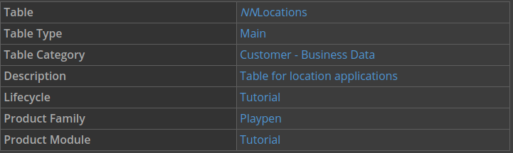

2. Open the Fields page, and then add the following data items:

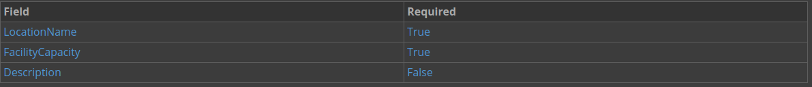

3. Open the Relationships page, and enter the following for your type ahead fields:

> ### The **Type Ahead / Search Field** and the Secondary **Type Ahead / Search Field** fields control how a table lookup that references this table works. Depending on how the table lookup is set up, the data items specified in the **Type Ahead / Search Field** and Secondary **Type Ahead / Search Field** fields can be used to identify records for the table lookup.

> ### For example, in a directory application you could configure **Username** as the the **Type Ahead / Search Field**, and Email as the Secondary **Type Ahead / Search Field** field. When a table lookup field points to the directory table and a user types in that field, the user would see matching records from both the **Username** and **Email** fields.

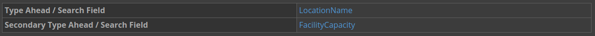

4. Click `Save and Exit`.

### Build a detail application

This application displays as the detail form of your relationship application. The layout configured here displays in the relationship application.

1. Open **Applications**.

2. Create a new application with the following information:

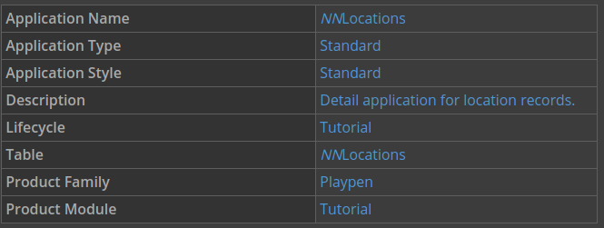

3. Open the List Form Fields page, and change the **Display** from `Excluded` to `Primary` for all of your fields.

4. Open the Detail Form Fields page, and then configure the field layout.

5. Save and generate your application.

Create a parent and child data items

Next you'll create table lookup data items which create a relationship between parent and child fields. You'll add these data items to a table for the relationships.

The data item that represents the child field is the primary identifying data item for a record, or the field you want to connect to. For example, the data item `ContactName` is often created as part of a standard application before it is used in a relationship application.

When you identify the need for a relationship application, you can create the parent data item. The parent field data item is never actually seen in the application, and is used as the internal connection. For example, `ParentContactName`. This data item is created for use in the relationship application.

1. In the **Data Items** application, create two new data items with the following information:

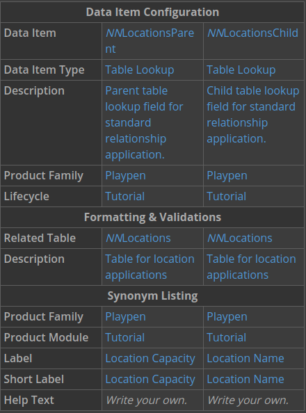

2. Click **Save and exit**.

Create a relationship table with parent and child fields

1. Open the **Tables** application.

2. Create a new table with the information below.

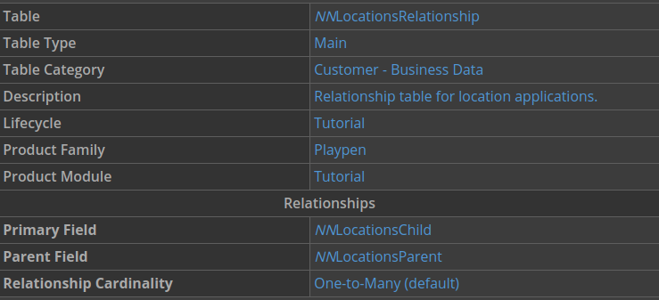

3. Open the Fields page, and add the following data items:

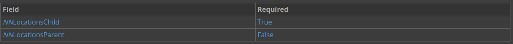

4. Click **Save and Exit**.

Build a Relationship application

1. Use the Navigation menu to open **Applications**.

2. Create a new application with the following information:

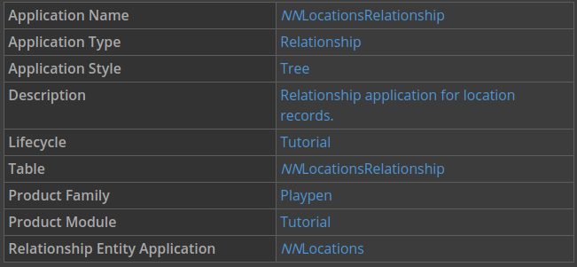

3. On the List Form Fields page, change the **Display** for each field from `Excluded` to `Primary` for your the fields that begin with `NNLocationsChild\_`.

4. On the Relationship Configuration page, enter `NNLocations` as the **Relationship Entity Application**.

5. Save and generate your application.

### Creating relationship records

Create relationships between the records you created in your detail application, and then you will create new records.

1. Launch your application.

This is the list form of your relationship application, and the tree region shows the hierarchical view of records.

2. Use the **Create** button to add records with the following information:

_Hint: Use the Save and Add New button._

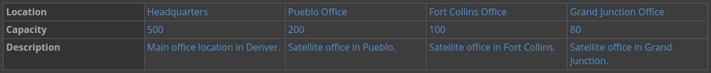

3. Hover over the Headquarters record in the tree form, and use the **+** button to add the following record:

This adds Conference Room as a child record to the Headquarters record.

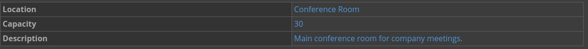

4. Click `Save and Exit`.

When you return to the tree form of the application, there is an expansion arrow next to the Headquarters record in the tree. When you click the icon, the child record Conference Room, expands.

## 2.2 NEXTWORLD EXAMPLE ChartOfAccountsTree TREE STYLE RELATIONSHIP APP

The **ChartOfAccountsTree** application is a helpful example of tree style relationship applications because it shows relationships between records in a hierarchical view.

### Object overview

This application is a listing of all general ledger accounts available for recording transactions. Use this application to view, edit, and create general ledger accounts and manage the hierarchical relationships between them.

### Configuration elements

The **ChartOfAccountsTree** application is built over the `GLAccountRelCOAJoin` table, which is a join table. The table joins the `GLAccountRelationship` table and the `ChartOfAccounts` table over the **GLAccount** and **nwid** fields.

In the `GLAccountRelCOAJoin` table the child field is `GLAccount` and the parent field is `ParentAccountNum`. Both of these data items are table lookups on the `ChartofAccounts` table. The relationship cardinality for this table is One-to-One.

The detail application of the **ChartOfAccountsTree** application is the **ChartOfAccounts** application, which is a standard application.

## 2.3 CHECKPOINT

You used existing data items to create a table, and then you created new data items that you used as parent and child fields when you created a relationship table. Then you built a detail application, and a tree style relationship application. You created location records in the tree style relationship application, and then created a child location for one of the records.

Be able to do the following:

- Configure Type Ahead and Secondary Type Ahead fields
- Create parent and child data items
- Create a relationship table
- Build a Tree style Relationship application
- Create records in a relationship application
- Add a child record in a Tree style Relationship application

---

- [Top](#Back_To_Top)

---

## 3.1 BUILD A STANDARD RELATIONSHIP APP

In this section, you'll build a standard style relationship application over your `NNLocationsRelationship` table

### Create a standard relationship application

1. In Applications, open your **NNLocationsRelationship** for editing.

2. Click **Save and Add Another** to create a new application.

This creates a new application over the same table.

3. Enter `NNLocationsRelationshipStandard` in the **Application Name** field.

4. Change the **Application Style** from `Tree` to `Standard`.

5. Save and generate your application.

### View relationships

1. Launch your application.

This is the list form of the application.

2. Open the Headquarters record.

This is the detail form of the record. This layout of this form defined in the detail application, **NNLocationsDetail**.

3. Click the Relationships page.

Records that are children of the Headquarters display on this page. You should see record for the Conference Room on this page.

4.  Click **Cancel** to return to the list form.

Create a record

1. In the list form of your application, click **Create**.

2. Enter the following information, and then click **Save and Exit**.

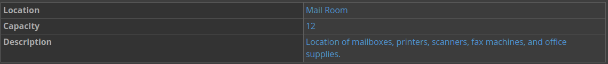

### Add a relationship

1. Open the Headquarters record.

2. Click the Relationships page.

3. Click **Add Relationship**.

4. In the **Location Name** field, enter `Mail Room`, and then click **Save and Exit**.

This adds a relationship between the Headquarters record and the Mail Room record. In a hierarchical view, the Mail Room would be a child of the Headquarters record.

## 3.2 NEXTWORLD EXAMPLE CustomerDirectory STANDARD RELATIONSHIP APP

The **CustomerDirectory** application is a helpful example of standard style relationship applications because you see the different relationships between customers. You can see records with multiple relationships, and navigate between their directory records.

### Object overview

The **CustomerDirectory** application is used to create customer records that are then stored in the `Directory` table.

Any relationships created between the primary customer record and other contacts are stored in the `ContactRelationships` table.

### Configuration elements

In the `ContactRelationships` table, the parent field is `RelatedContact` and the child field is `Contact`. These data items are both table lookups on the `Directory` table. There is no relationship cardinality on this table. The type ahead field of the relationships field is **Contact**. The detail application is **Customers**, which is built over the `Directory` table.

## 3.3 CHECKPOINT

You built a standard style relationship application over the relationship table that you created. Then you created records in the application, and added relationships between them.

Be able to do the following:

- Create multiple applications over a table
- Build a Standard style Relationship application using an existing table
- Locate and then update relationship records

---

- [Top](#Back_To_Top)

---
