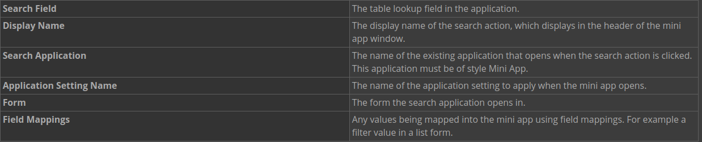
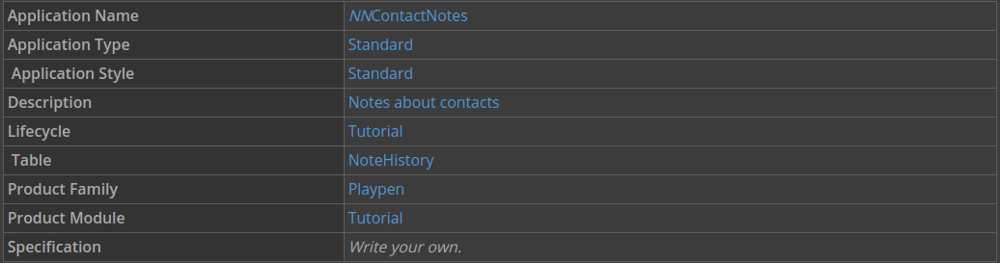
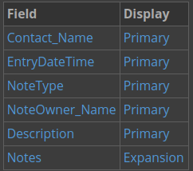
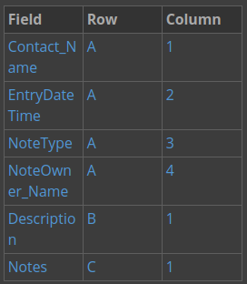
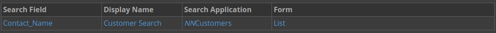
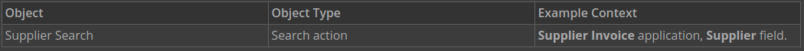

---
 Top
---

- ### [1 UNDERSTANDING SEARCH ACTIONS](#1_UNDERSTANDING_SEARCH_ACTIONS)
- ### [2 CONFIGURE A SEARCH ACTION](#2_CONFIGURE_A_SEARCH_ACTION)
- ### [3 NEXTWORLD EXAMPLE SUPPLIER SEARCH SEARCH ACTION](#3_NEXTWORLD_EXAMPLE_SUPPLIER_SEARCH_SEARCH_ACTION)

---

## 1 UNDERSTANDING SEARCH ACTIONS

A search action provides a way to search the records of another application, and is always used with a table lookup field to open a mini app. From the mini app, users can select a record and return a value to the table lookup field.

Search fields are indicated by a `magnifying glass` icon in an application. There are two different ways a user can search for values in a search field. First, as they type, values appear that they can select. Second, users can click the `magnifying glass` icon to open the search application.

### Configuration

A search action is an action users can perform in an application to search records in a separate application. Search actions define what application, known as the _search application_, opens when a user clicks the `magnifying glass` icon. Search actions are configured in **Applications**, on the Actions page. When you configure a search action, you define the following:

Think of a search action with a mini app as an additional step to a table lookup. Use a search action mini app with a table lookup when you need to view the complete record instead of a single value. For example, if you use a table lookup field to search employee records by last name, you would get multiple results for the same last name, such as `Arnold`. You could use a search application to display the records, and select the one you want for the specified name.

---

- [Top](#Back_To_Top)

---

## 2 CONFIGURE A SEARCH ACTION

In this section, you'll build an **NNContactNotes** application to keep notes about certain contacts, and then connect the mini app you built in the last section, **NNCustomers**, as a search action on the **Contact** field. That means that when you click the magnifying glass icon next to the **Contact** field in your generated application, the **NNCustomers** application opens.

### Build a Contact Notes application

1. In Applications, create a new application with the following information:

2. Configure the following display options on the List Form Fields page:

3. On the Detail Form Fields page configure the following:

4. Save and generate your application.

### Add a search action

Use the Actions page in **Applications** to configure a search action.

1. In Applications, open your **NNContactNotes** application for editing.

2. On the Actions page under **Search Actions**, click **Add**.

3. Enter the following information to configure your search action:

4. Save and generate your application.

Use the search action

1. In **Applications**, use the Actions menu to launch the NNContactNotes application.

2. Create a new record.

3. Use the search action to select the record you created in the last section.

4. Complete the record, and then click **Save and Exit**.

---

- [Top](#Back_To_Top)

---

## 3 NEXTWORLD EXAMPLE SUPPLIER SEARCH SEARCH ACTION

The `Supplier Search` search action in the **Supplier Invoices** application is a helpful example of search actions because it shows how search actions display the records of an application. When you click on the magnifying glass icon, the **SupplierSearch** application opens.

Object overview

The `Supplier Search` action is used in the **Supplier Invoices** application. It opens the `SupplierSearch` application, which displays records from the **Supplier** application.

Configuration elements

The `Supplier Search` search action opens the `SupplierSearch` application with the `SupplierSearchSettings` application setting applied. The application setting enters default field values when new records are created, and enters default filter values when the list form is opened.

This search action adheres to the naming conventions surrounding search actions. The search application name, `SupplierSearch` follows the naming convention of using the word `search` in the application name to indicate a search action. You can learn more in the **_NAMINGCONCENTIONSANDSTANDARDSAPPLICATION_** topic.

---

- [Top](#Back_To_Top)

---
