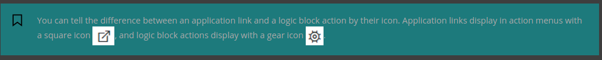
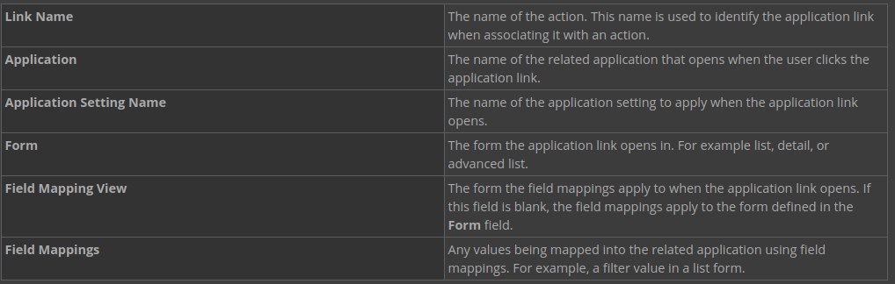
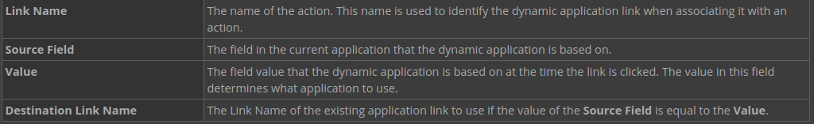
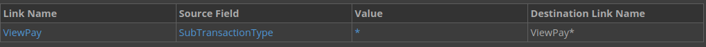
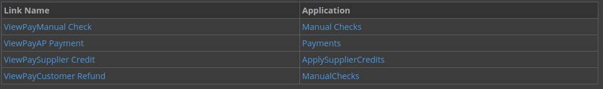
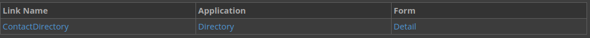
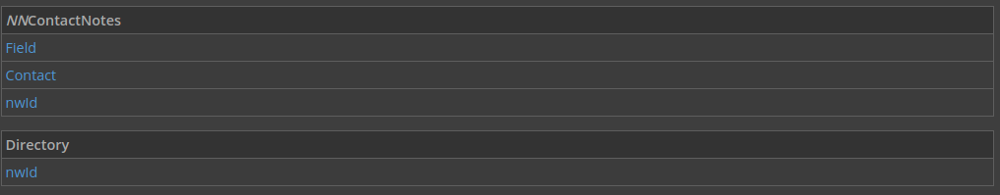
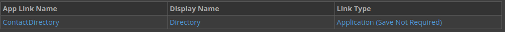
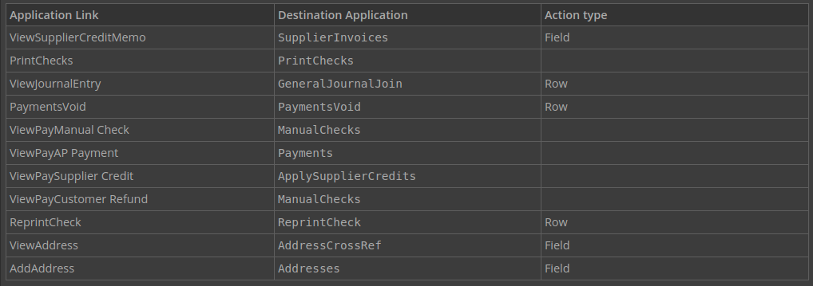

---
 Top
---

- ### [1 UNDERSTANDING APPLICATION LINKS](#1_UNDERSTANDING_APPLICATION_LINKS)
- ### [2 DYNAMIC APPLICATION LINKS](#2_DYNAMIC_APPLICATION_LINKS)
- ### [3 DYNAMIC APPLICATION LINKS & WILDCARD CHARACTERS](#3_DYNAMIC_APPLICATION_LINKS_&_WILDCARD_CHARACTERS)
- ### [4 CONFIGURE AN APPLICATION LINK](#4_CONFIGURE_AN_APPLICATION_LINK)
- ### [5 NEXTWORLD EXAMPLE APPLICATION LINK](#5_NEXTWORLD_EXAMPLE_APPLICATION_LINK)

---

## 1 UNDERSTANDING APPLICATION LINKS

Application links let users navigate to a related application or application record from the current application. They are used in applications through field, row, and form actions.

Creating an application link configures a connection to a second application, including associating the connection with an application setting and field mapping. However, the application link does not appear in the application until it is associated with an action.

Application link actions can be associated with the following types of actions:

- Form action
- Row action
- Field actions

Configuration

An application link results in a button that a user can click to navigate to a related application or application record. Application links are configured in **Applications**, on the Actions page. When you configure an application link, you define the following:

---

- [Top](#Back_To_Top)

---

## 2 DYNAMIC APPLICATION LINKS

Dynamic application links are links to a related application that are evaluated and selected based on the value in a specified field at the time the link is clicked. Dynamic applications links use the value in the field to determine which application link to use.

The dynamic application link must be used like application links, and like those links does not appear in the application until the link is associated with an action.

### Configuration

Dynamic application links are configured in Applications, on the Actions page. When you configure a dynamic application link, you define the following:

---

- [Top](#Back_To_Top)

---

## 3 DYNAMIC APPLICATION LINKS & WILDCARD CHARACTERS

Use dynamic application links to change which application link appears based on the value of a certain field.

Configure an application link with the asterisk (\*) wildcard character in place of a field value to connect a single dynamic application link with multiple application links. Configure the application link names so they begin with the same name as the dynamic application link. Then, instead of an asterisk, put the field value you expect in the name of the application link. This configuration results in each field value being connected to a different application link, and in turn a different application.

For example, the dynamic application link name in the Payments application is ViewPay\* , you would configure the following dynamic application link:

In this application, you could have the following application links configured:

---

- [Top](#Back_To_Top)

---

## 4 CONFIGURE AN APPLICATION LINK

In this section, you'll create an application link that opens the **Directory** application. You will configure a field mapping so that when the application link is opened, it opens the directory record for the specific contact. Then you'll configure the application link as a row action.

### Add an application link

1. Open your `NNContactNotes` application for editing.

2. On the Actions page under **Application Links**, click **Add**, and then enter the following information:

### Configure field mappings

1. Click in the **Data Mappings** field.

The data mapper opens when you click into the field.

2. Click **Add Mapping**, and then enter the following information:

This configuration results in the contact value from the `NNContactNotes` application row being populated in the `ContactHistory` application when it opens.

Add your application link as a row action

1.  Under **Row Actions** click **Add**, and then enter the following information:

Adding the application link as a row action results in an option in the Action Menu that opens the **Directory** application.

2. Save and generate your application.

### Use your application link

1. Launch your `NNContactNotes` application.

2. Open the row action menu for a record, and then click **Directory**.

Notice that the application opens for a specific contact. The contact that opens is the contact in the row from which you opened the application link.

---

- [Top](#Back_To_Top)

---

## 5 NEXTWORLD EXAMPLE APPLICATION LINK

The **Payments** application is a helpful example of application links because is shows the different ways application links can be configured. The application links in this application are configured as row, form, and field actions. In addition, it shows how to design a user flow through different related applications to complete a transaction.

Object overview

The **Payments** application uses application links to provide users a way to navigate through business processes that span through different related applications.

Configuration elements

The **Payments** application has application links to several applications, including:

- PrintChecks
- GeneralJournalJoin
- PaymentsVoid
- ManualChecks
- Payments
- ApplySupplierCredits
- ManualChecks
- ReprintCheck
- AddressCrossRef
- Addresses

---

- [Top](#Back_To_Top)

---
