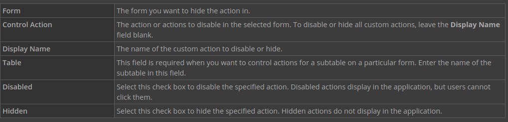
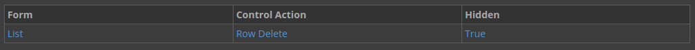

---
 Top
---

- ### [1 UNDERSTANDING CONTROL ACTIONS](#1_UNDERSTANDING_CONTROL_ACTIONS)
- ### [2 CONFIGURE A CONTROL ACTION](#2_CONFIGURE_A_CONTROL_ACTION)
- ### [3 CHECKPOINT](#3_CHECKPOINT)

---

## 1 UNDERSTANDING CONTROL ACTIONS

Control actions are associated with the buttons and action menu options available for a specified application form. Configuring a control action allows you to hide or disable actions.

Add control actions in **Applications**, on the Actions page. Use them to hide or disable form, row, or custom actions.

When you configure a control action, you define the following:

---

- [Top](#Back_To_Top)

---

## 2 CONFIGURE A CONTROL ACTION

In this section, you'll add a control action to your mini app that hides the **Delete** button.

### Hide the delete button

1. Open your `NNCustomers` application for editing.

2. On the Actions page under Control Actions, click **Add**.

3. Enter the following information to create a control action that hides the **Delete** button:

4. Save and generate your application.

### Test your control action

1. Launch your `NNCustomers` application.

2. Open the Row Action menu for one of the records.

The **Delete** button should be hidden.

## 3 CHECKPOINT

In this tutorial, you built an application and a mini app, then you added the mini app as a search action to the application, added an application link to the application, and configured the control actions on the mini app.

Be able to do the following:

- Build a mini app
- Create a search action that opens your mini app from a table lookup field
- Create an application link and set it as a row action
- Create a control action to hide the delete button
