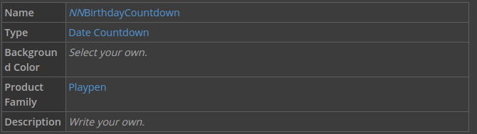
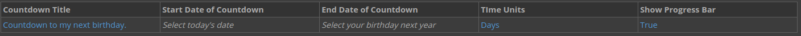
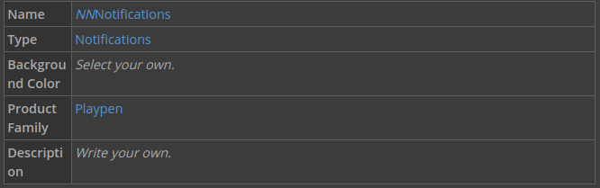
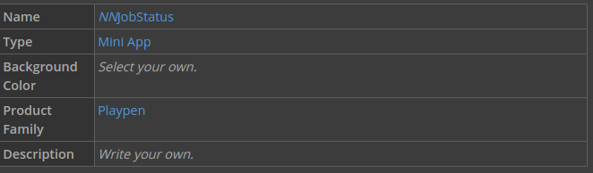
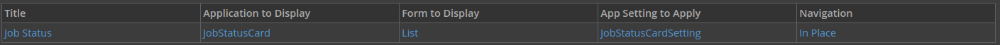
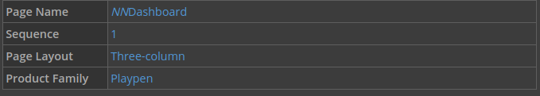
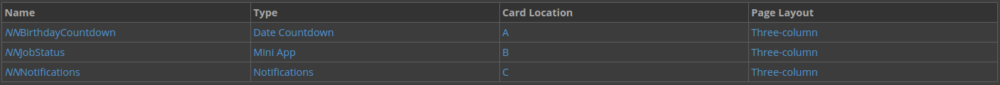

In this tutorial, you'll learn about Nextworld dashboard pages, which contain dashboard cards. You'll start by creating different types of dashboard cards to display a date countdown, Nextworld notifications, and a mini app. Then you'll create a dashboard page, and add your dashboard cards to the page. After you save your page, you'll be able to immediately view and interact with it.

This tutorial contains the following sections:

- Understanding dashboards
- Create dashboard cards
- Build a dashboard page
- Checkpoint

---

##  Top

- ### [1 UNDERSTANDING DASHBOARDS](#1_UNDERSTANDING_DASHBOARDS)
- ### [2 CREATE DASHBOARD CARDS](#2_CREATE_DASHBOARD_CARDS)
- ### [3 BUILD A DASHBOARD PAGE](#3_BUILD_A_DASHBOARD_PAGE)
- ### [4 CHECKPOINT](#4_CHECKPOINT)

---

## 1 UNDERSTANDING DASHBOARDS

When you log in to Nextworld, you go to the Nextworld Dashboard, which is comprised of dashboard pages. Dashboard pages provide a way to display information overviews, summaries, and reports. Dashboard pages are fully customizable, and can be shared across users. Like most objects in Nextworld, dashboard cards use information that is custom.

You can use dashboard cards to create configurations of information. Dashboard cards can display information from an application, in a different format. There are many types of dashboard cards, including:

- Date Countdown
- Mini Application
- Notifications

You add dashboard cards to dashboard pages, which a user can open and flip through. You can configure the layout and appearance of cards on the page. This means that you can organize areas of information into pages. For example, a company could have one financial dashboard page that contains payables information such as invoices, contact history, contact notes, and payment details. The company could have another financials dashboard page that contains receivables information such as cash receipt details, invoices, and accounts receivable aging.

Information displayed on dashboard cards is generated when the dashboard is opened, which means it is always up-to-date.

Learn more in the **_DASHBOARDS_** topic.

---

- [Top](#Back_To_Top)

---

## 2 CREATE DASHBOARD CARDS

In this section you'll configure different dashboard cards to use on a dashboard page.

### Create a new dashboard card

Start by creating a dashboard card that counts down to your birthday.

1. Open **Dashboard Cards** application.

2. Create a new dashboard card with the following information:

3. Configure the following:

4. Click **Save and Add New**.

### Create a notifications dashboard card

Next, create a dashboard card to display the notification information.

1. Create a notifications card with the following information:

2. Select the **Show Notification Details** check box.

3. Click **Save and Add New**.

Create a mini app dashboard card

Now, use the **Job Status** mini app to create a dashboard card.

1. Create a mini app card with the following information:

2. Enter the following information, and then click **Save and Exit.**

---

- [Top](#Back_To_Top)

---

## 3 BUILD A DASHBOARD PAGE

In this section you'll build a dashboard page using the cards you created in the last section.

### Create a dashboard page and add cards

1. Open the **Dashboard Pages** application.

> ### You can also create a new dashboard page by clicking the +Add Page button on your home page. This button is located in the top-right corner, just below the Logout button.

2. Create a new dashboard page with the following information:

3. Under **Page Cards**, use the **Add** button to enter the following information, and then click **Save and Exit**.

This adds your dashboard cards to your dashboard page.

### Test your dashboard

1. Navigate to the dashboard.

2. Open the Navigation menu, and then click **Refresh**.

You can also log out, and then log back in to see your changes.

3. Open your page by clicking on the dashboard drop-down, and then selecting your dashboard page.

4. Verify that your dashboard cards are displaying correctly.

---

- [Top](#Back_To_Top)

---

## 4 CHECKPOINT

In this tutorial, you created different types of dashboard cards, built a dashboard page, and then added the dashboard cards you made to the dashboard page.

Be able to do the following:

- Create dashboard cards with custom information
- Create a new dashboard page to display your dashboard cards
- Configure the layout of a dashboard page

---

- [Top](#Back_To_Top)

---

[Table Lookups -> nwId](https://github.com/WNortier/nextworld/blob/master/nextworld-platform-tutorials/01-build-an-application/00-build-an-application-overview.md#3_TABLE_LOOKUPS)
