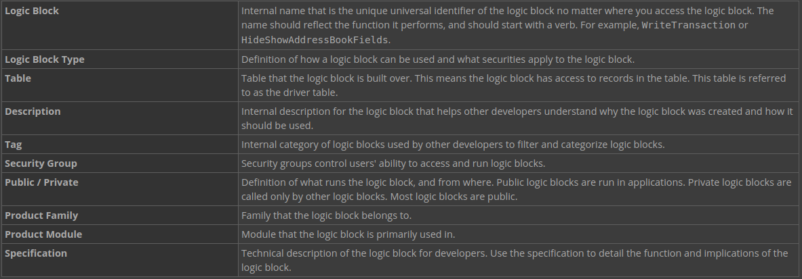
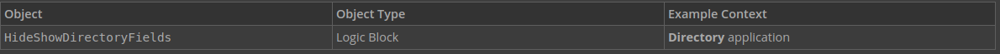
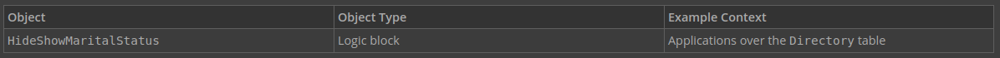
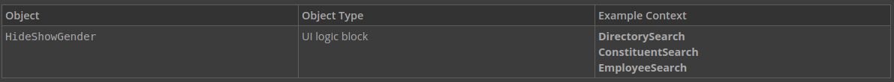
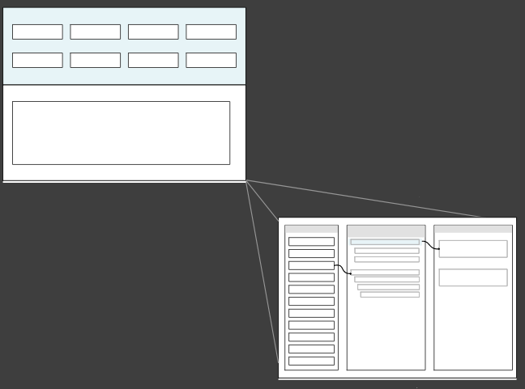

# Introduction to Logic Blocks

In this tutorial, you'll learn the basics of logic blocks, which are used for complex business processes. You'll be introduced to the Logic Block Builder, and the actions you use to build logic blocks. You'll learn the foundations of logic blocks including naming and commenting conventions. Finally, you'll apply your knowledge when you build a logic block that hides and shows fields of the PaymentTerms application you built.

This tutorial contains the following sections:

- Understanding logic blocks
- Logic Block Builder
- Logic block foundations
- Logic blocks and actions
- Build a logic block

---

##  Top

---

- ### [1 UNDERSTANDING LOGIC BLOCKS](#1_UNDERSTANDING LOGIC BLOCKS)
- ### [2 EXAMPLE HideShowDirectoryFields UI LOGIC BLOCK](#2_EXAMPLE_HideShowDirectoryFields_UI_LOGIC_BLOCK)
- ### [3 EXAMPLE HideShowMaritalStatus UI LOGIC BLOCK](#3_EXAMPLE_HideShowMaritalStatus_UI_LOGIC_BLOCK)
- ### [4 EXAMPLE HideShowGender UI LOGIC BLOCK](#4_EXAMPLE_HideShowGender_UI_LOGIC_BLOCK)
- ### [5 LOGIC BLOCK BUILDER](#5_LOGIC_BLOCK_BUILDER)

---

## 1 UNDERSTANDING LOGIC BLOCKS

Logic blocks are groups of logical expressions that interact with applications, application records, and tables.

Logic blocks vary in complexity. For example, if you were working with a financial ledger application that tracks deposit information, you could use a simple logic block to show the transaction link ID field for voiding transactions. In comparison, you could use a complex logic block to fetch records from a financial ledger application and insert them into an invoice records application.

There are several different types of logic blocks, including:

- **UI** — controls elements of the user interface such as hiding and disabling fields.
- **Validation** — validates data by either comparing fields within a record or between records. Fields are compared - between records by fetching records from other tables.
- **Transaction** — modifies data by updating, deleting, inserting, or fetching records.
- **Background Task** — runs in the background, and then displays results in the notification menu so that users can continue working without waiting for a significant logic block.

You can read more in the **_LOGIC BLOCK TYPES_** topic.

> ### Logic blocks are requirement-based. That is, they are determined by the application's requirements. Logic blocks are an integral part of an application, and you should consider them while you are designing the application.

You build a logic block over a table, in the same way that you build an application over a table. This table is known as a driver table, which is the main data source of the logic block. It's structure determines the input and output fields available to the logic block.

When creating a logic block, you configure the following in **Logic Blocks**:

After you build a logic block, you add it to an application built over the same table, or a table, or as part of another logic block. This enables you to use the logic block as part of the application. When you add a logic block to an application, you configure when and where the logic block is activated in the application.

---

- [Top](#Back_To_Top)

---

## 2 EXAMPLE HideShowDirectoryFields UI LOGIC BLOCK

The `HideShowDirectoryFields` logic block is a helpful example of a UI logic block because it shows and hides different fields depending on specific values.

### Object overview

The `HideShowDirectoryFields` logic block is used in the **Directory** application to hide and show fields when the value of the **ContactRole** or **ContactType** field is changed, and when the form is initialized. This logic block retrieves module settings from the `BaseSettings` table. In later actions, this logic block fetches the `DefaultPersonNameFormat` and `DefaultOrgNameFormat` table lookups.

### Configuration elements

This example runs both when the form is initialized and when field values are changed. The Directory application is reused in different ways, and contains records for different contact types like employees and suppliers. Because of the different ways users interact with the application, it is important to ensure that the correct fields are hidden or shown.

The conditional actions in this logic block follow the best practice of always having actions defined in the true branch.

---

- [Top](#Back_To_Top)

---

## 3 EXAMPLE HideShowMaritalStatus UI LOGIC BLOCK

---

- [Top](#Back_To_Top)

---

## 4 EXAMPLE HideShowGender UI LOGIC BLOCK

The `HideShowGender` logic block is a helpful example of a UI logic block because it hides and shows fields based on a field value.

### Object overview

The `HideShowGender` logic block is used in the **DirectorySearch**, **ConstituentSearch**, and **EmployeeSearch** applications to hide and show the **Gender** field when the **ContactRoleGrouping** field value contains specific values.

### Configuration elements

One of conditional actions in this logic block groups the expressions with an OR, instead of an AND. This consolidates the actions necessary to validate when to perform an action.

---

- [Top](#Back_To_Top)

---

## 5 LOGIC BLOCK BUILDER

When you create a logic block, you use the **Logic Blocks** application to define the driver table and other attributes of the logic block. Through records in the Logic Blocks application, you have access to the Logic Block Builder, which is how you configure the function, or logic, of the logic block.

The diagram below shows the flow from the **Logic Blocks** application to the Logic Block Builder.

The `Logic Block Builder` is where you assemble the components of a logic block. It is a builder tool where you can add and reorder actions, and define expressions. The Logic Block Builder is comprised of three sections, or panels. Each panel serves a different purpose in building a logic block, as described below.

**Actions** — list of all available actions or instructions to create logic flows. This panel is only visible when you have access to edit the logic block. You have access to edit the logic block when it is in the lifecycle that you are working in.
**Logic Block** — the logic flow of actions. Drag actions to add sequence.
**Details** — definition of the attributes and characteristics of each action.

> ### You can get more information, conventions, and guidelines in the Logic block foundations topic.

---

- [Top](#Back_To_Top)

---

[Table Lookups -> nwId](https://github.com/WNortier/nextworld/blob/master/nextworld-platform-tutorials/01-build-an-application/00-build-an-application-overview.md#3_TABLE_LOOKUPS)
