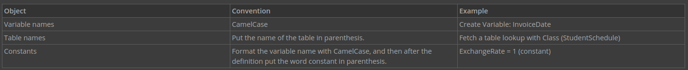

# Logic Block Foundations

Following logic block foundations when building logic blocks makes the logic blocks better built.

When building your logic block, you want it to be:

- **Readable**. In other words, understandable and usable by others without additional explanation. Keeping your logic simple makes it easy to understand.

- **Maintainable**. It should be easily understood by others, so they can make necessary updates.

- **Efficient**. Your logic block should meet requirements in an efficient way, as a result of being well thought-through. This means that you should take the time to consider your approach, and think through the actions and flow before you start building. Also consider the performance of the logic block, which should also be efficient.

> ### To figure out the maintainability of a logic block, think about the amount of time it takes someone to make a change, and the risk that the change could break something.

---

##  Top

---

- ### [1 LOGIC BLOCK BUILDER NAMING CONVENTIONS](#1_LOGIC_BLOCK_BUILDER_NAMING_CONVENTIONS)
- ### [2 ADDITIONAL LOGIC BLOCK CONVENTIONS](#2_ADDITIONAL_LOGIC_BLOCK_CONVENTIONS)
- ### [3 LOGIC BLOCKS & ACTIONS](#3_LOGIC_BLOCKS_&_ACTIONS)

---

## 1 LOGIC BLOCK BUILDER NAMING CONVENTIONS

Consistent naming conventions for variables makes it easy to identify different elements when reading logic block comments.

Once you establish conventions, maintain them throughout the entire logic block. This means that when you establish a convention, think about how it will apply to the different elements you’ll use in the logic block.

For example, if records from the Directory application are fetched twice, first to find suppliers and again to find customers, it is confusing to name both fetches FetchDirectory. Use FetchSupplierDirectory and FetchCustomerDirectory to make it clear and easy to identify which name to reference later in the logic block.

In addition to the name, formatting key objects consistently makes them easy to identify in comments. Formatting refers to how the object is typed out in the comment, such as whether it is capitalized, contains special characters, or spaces.

For example, here are some of the conventions used in Nextworld logic blocks:

---

- [Top](#Back_To_Top)

---

## 2 ADDITIONAL LOGIC BLOCK CONVENTIONS

To create a well-built logic block, ensure that you define your variables at the top, peer review your logic, and avoid hardcoding values.

- **Set variables at the top** — makes your logic block more organized and easier to maintain. Defining the variables at the top makes them easy to find and allows others reading your logic block to know what variables are used. This ensures that you don't try to use a variable that hasn't been defined.

- **Peer review your logic** — ensures that your logic makes sense to all. A new perspective helps to make sure your logic is not repeating itself. When you have doubts about your logic, have a peer review it.

- **Avoid hard coding values** — makes your logic block more dynamic, and easier to use in different contexts. Hard-coding values refers to using a specific value instead of using a calculated or referenced value. Point to a value within the logic block, rather than entering a value manually.
  - For example, if you create a logic block that sets the fiscal quarter when a new invoice is created, don't enter `January 1` in your set value action. Enter `Fiscal Year Start` instead.

## 3 LOGIC BLOCKS & ACTIONS

Logic blocks run when the user performs specific actions in an application. When you connect a logic block to an application, you identify the type of user action that causes the logic block to run.

Connecting a logic block to a user action is part of the application design in **Applications**. The user actions that can run a logic block are categorized into the following types:

### Field Actions

Field actions apply to individual fields, and result in a button below the field. The logic block only runs when the user clicks the button, so use a field action if the logic block is optional. You can use a field action when the logic block only applies to a field within a record, and not the entire record.
For example, in **Supplier Invoices**, there is a field action for the **Name** that loads the last invoice for the supplier. Because several of the fields do not change between invoices, such as **Billing Address**, **Name**, or **Payment Terms**, loading information from the last invoice can save time and reduce the margin for error. It isn’t necessary for the last invoice to be loaded every time a new invoice is entered, or every time a new value is entered in the Name field. This field action displays under the **Name** field as the **Load Last Invoice** button.

### Row Actions

Row actions apply to entire records. Adding a row action creates a new action menu option:

- In the detail list region of the application list form

- In the application action menu at the top of the detail form

Configure a logic block with a row action when the logic block acts on the entire record.

For example, in the **Journal Entries** application, the **Void** row action voids the current journal entry record.

### Event Actions

Event actions automatically run as the user interacts with the application. Use an event action when you want the logic block to run automatically, without requiring an explicit user command. Event actions are part of the application design.

For example, the **ExpenseReport** application, the **Transaction Amount** field is calculated by a logic block (to reduce the chance of user error), and is added as an event action. The total must be calculated because it is used by other applications, such as **Payments**.

You can configure event actions to occur with different user action including:

- **Form is Initialized** — the user opens the application in an application form.

- **Field Entered** — the user tabs or clicks into a field.

- **Field Exited** — the user clicks or tabs out of a field.

- **Field Value Changed** — the user changes the value in the defined field and then exits the field, or hits enter.

- **Row Entered** — the user clicks into a row. This action only applies to header detail, relationship, and advanced list applications.

- **Row Exited** — the user clicks out of a row. This action only applies to header detail, relationship, and advanced list applications.

- **Row Changed** — the user changes a value in a row, and then exits a row or hits enter. This action only applies to header detail, relationship, and advanced list applications.

- **Row Deleted** — the user deletes a row. This action only applies to header detail or relationship applications.

- **Multi Row Select** — the user selects select all or clear all visible check boxes using the actions menu in the filter row of the detail list. This action only applies to header detail and advanced list applications.

- **Header Changed** — the user changes any field in the header. This action only applies to header detail applications.

- **Advanced List Form is Initialized** — the user opens an advanced list application in the advanced list form. This action only applies to advanced list applications.
