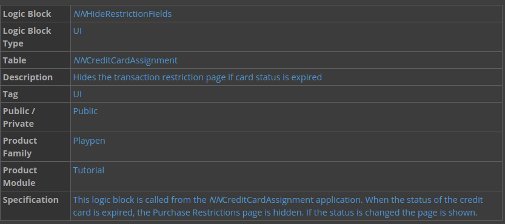
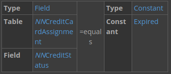
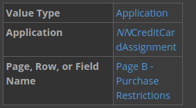
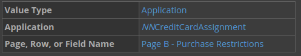
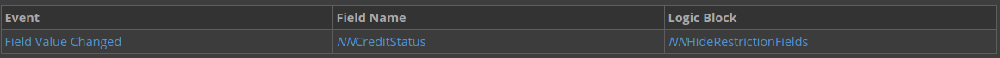

---
##  Top
---

- ### [1 BUILD A LOGIC BLOCK](#1_BUILD_A_LOGIC_BLOCK)
- ### [2 CHECKPOINT](#2_CHECKPOINT)

---

## 1 BUILD A LOGIC BLOCK

In this tutorial, you'll create a new logic block definition, and then you'll build a logic block. Your logic block will hide and show the Purchase Restrictions page of the **NNCreditCardAssignment** application, depending on the value in the **Credit Status** field. After you build and generate your logic block, you'll add it to your **NNCreditCardAssignment** application as an event action. After you save and generate your application, you'll test if your logic block works in the application.

You must complete the **_BUILD AN APPLICATION_** tutorial, and build the `NNCreditCardAssignment` application as a prerequisite for this tutorial.

[Table Lookups -> nwId](https://github.com/WNortier/nextworld/blob/master/nextworld-platform-tutorials/01-build-an-application/00-build-an-application-overview.md#3_TABLE_LOOKUPS)

### Logic block requirements

In other logic block tutorials, you'll get logic block requirements and build the logic block yourself. In this tutorial, you'll get step-by-step instructions for building your logic block. Logic blocks are always built based on requirements, and you will always receive requirements before you build a logic block.

The purpose of the logic block you build is to hide the Purchase Restrictions page when a card is expired. This is because the information on the Purchase Restrictions page is not necessary if a card is expired.

Here are the requirements for the logic block you'll build:

- Validate if the **Credit Status** is `expired`.

- Hide the Purchase Restrictions page. If the **Credit Status** is `expired` users don't need to use the page.

- Show the Purchase Restriction page. If the **Credit Status** is not `expired` you want the page to show again.
  Create a new logic block definition

### Create a new logic block definition

1. Open the **Logic Blocks** application, and then click **Create**.

2. Enter the following information, and then click **Save and Exit**.

> ### You must build your logic block in the same lifecycle as your table. The only exception to this is if the table you use is in the base lifecycle. If you create your logic block in a different lifecycle, you will not be able to save your logic block.

### Validate if the Credit Status is expired

In this section, you define the conditional expression. You'll use this conditional to define the conditions of when to hide or show the fields. The conditional action compares two values so that you can perform other actions based on whether the condition is true or false.

1. In the **Logic Blocks** application, filter for your `NNHideRestrictionFields` logic block.

2. Open the actions menu and select **Logic Block Builder** to open the Logic Block Builder.

3. Drag the **Conditional (if/then/else)** action from the Actions (left) panel to the Logic Block (middle) panel.

4. In the Details (right) panel, click **Add Expression**.

5. To define the conditional as, If the value of _NNCredit is equal to Expired_, enter the values below:

### Hide the Purchase Restrictions page

Now that you've created the conditional action, you can define what action is performed when the conditional is met. In this logic block, when the condition of "If the value of **NNCreditStatus** is equal to `Expired` is true, the hide actions are performed." If the condition is false, the page will display.

1. Drag the **Hide** action into the true branch of the conditional action.

2. Click **Add Input** to enter the following information in the Details panel:

### Show the Purchase Restrictions page.

If you change the **NNCreditStatus** field from `Expired`, the page will not show again unless you define the action in the logic block.

1. Drag the **Show** action into the false branch of the conditional action.

2. Click the **Add Input** button, and then enter the following:

3. Save your logic block.

4. Using the Actions menu, generate your logic block.

### Add your logic block to an application

1. In **Applications**, filter for your **NNCreditCardAssignment** application, and then open it to add your logic block.

2. On the Actions page, use the **Add** button to configure a new event action, and then enter the following information:

You're defining what logic block to use, and when it is triggered. In this case, the logic block is triggered when you change the value of the NNCreditStatus field.

3. Save and generate your application.

### Test your logic block

1. Launch your **NNCreditCardAssignment** application, and then create a new record

Notice that when you set the status to `Expired`, the Purchase Restriction page is hidden.

2. Save your record.

---

- [Top](#Back_To_Top)

---

## 2 CHECKPOINT

In this tutorial, you learned about logic blocks, conventions, and the logic block builder. Then you built a logic block and added it to your application as an event action.

Be able to do the following:

- Understand the relationship between logic blocks and tables
- Follow logic block naming, commenting, and additional conventions
- Create a logic block
- Add actions to a logic block
- Add a logic block to an application as an event action

---

- [Top](#Back_To_Top)

---
