In this tutorial, you'll learn about specific considerations for using currency fields in logic blocks. You'll learn about the different parts of currency fields, which variables to use, and how currencies are configured and stored. Then you'll build an expense report application that includes currency fields. Then you'll build a logic block that sets the transaction currency for an expense report record. After you build your logic block, you'll add it to your expense report application, and then test your logic block.

This tutorial contains the following sections:

Currency and logic blocks

- Currency in logic blocks
- Build an expense report application
- Build a currency logic block

---

##  Top

---

- ### [1 CURRENCY IN LOGIC BLOCKS](#1_CURRENCY_IN_LOGIC_BLOCKS)
- ### [2 CURRENCY MATH](#2_CURRENCY_MATH)
- ### [3 BUILD AN EXPENSE REPORT APPLICATION](#3_BUILD_AN_EXPENSE_REPORT_APPLICATION)

---

## 1 CURRENCY IN LOGIC BLOCKS

Currency fields in Nextworld allow for flexible use and manipulation in logic blocks and other contexts. This topic explains currency for how fields are stored, what currency-specific system values can be used, and where currency codes are configured and stored.

### Currency fields

Currency fields are stored as objects that consist of two parts, the number and the code. These two parts make up the field value. This means that you can manipulate the value (number and code), or just the currency code of a field in a logic block. For example, if the value of the **TransactionAmount** field is `12.00 USD`, `12.00` is the number, and `USD` is the code. You could then do math with the field value, such as adding it to other values. However, using an empty currency field in math results in an error.

In logic blocks, you select the _attribute_ of a currency field, which determines how the field can be used in the logic block. The attributes are _value and code_. Use the value attribute to use the value in math actions, and use the code attribute to set or use the currency code.

### ZeroCurrency

Use the ZeroCurrency system value to set the value of a currency field or variable to zero. When you set a field to ZeroCurrency, you must also set the currency code in the same action. This is because ZeroCurrency is considered the number of the field and the field needs a code, too. Use this instead of clearing a currency field, because you cannot do math with an empty, or null, field. While you can't compare an empty currency field to ZeroCurrency, you can do math with a ZeroCurrency field. You can also compare currency fields to ZeroCurrency instead of 0.00 USD. For example if you want to validate if a field value is greater than zero, you would configure your expression to, `if **TransactionAmount** > greater than ZeroCurrency`. Comparing currency fields to `0.00 USD` results in an error.

> ### The only time you must explicitly set a currency code is when you set the value to `ZeroCurrency`. Because currency fields require a code, if a field contains a value the code for the field has already been set.

### CurrencyConfig

The `CurrencyConfig` table is used to manage the different currencies available for transactions. This table is fetched in logic blocks to ensure currency codes used are valid. In other words, instead of hard-coding currency codes that could later be invalid, you fetch values in a table.

---

- [Top](#Back_To_Top)

---

## 2 CURRENCY MATH

When you use currency fields and values in math actions in a logic block, you must consider the following currency rules to avoid errors.

### Code and value rules

1. All inputs and outputs must have the same currency code.
2. Set the value, and then set the code for currency fields. You can't set only the code of a field that is empty.
3. At least one of the inputs in the equation must have a value and a code.
4. Never hard-code currency values.
5. Outputs inherit the currency code of inputs.

The table below shows different scenarios for adding or subtracting currency fields, and what rules they follow.

---

- [Top](#Back_To_Top)

---

## 3 BUILD AN EXPENSE REPORT APPLICATION

In this section, you'll use existing data items to build three tables. Then you'll build applications over those tables, resulting in a header detail application. This application is a simplified version of the Nextworld **ExpenseReport** application.

Create a detail table

These table fields display in the header detail application. The layout and display of these fields is configured in the detail application.

The data items that you use in this tutorial are base objects, so you don't need to create any data items.

1. In the **Tables** application, create a new table with the information below.

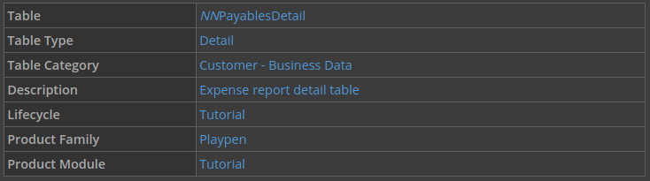

2. Open the Fields page, and then add the following fields:

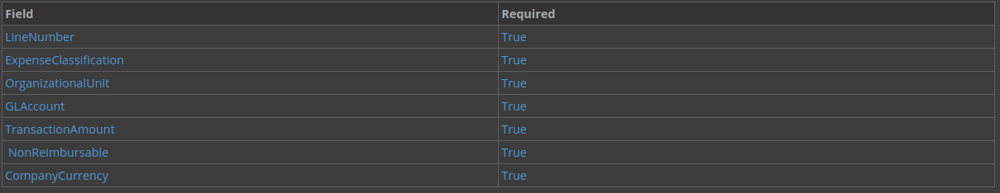

3. Click Save and Exit.

### Create a header table

The following table fields display in the header detail application. The layout and display of these fields is configured in the header detail application.

1. Create a new table with the following information:

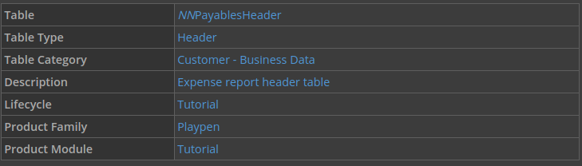

2. Open the Fields page, and add the following fields to your table:

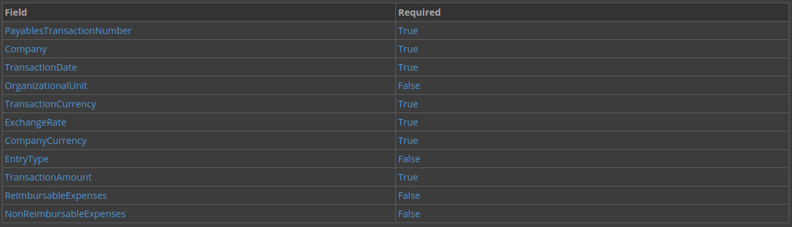

3. Click **Save and Exit**.

### Create a header detail table

The header detail table is what creates the connection between the header table and the detail table that you created.

1. Create a new table with the following information:

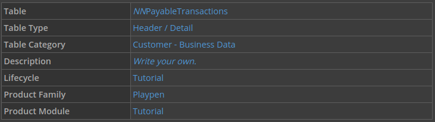

2. Open the Header / Detail page.

3. Define your header and detail tables, using the **Header Table** and **Detail Table** fields as follows:

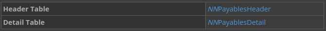

4. Click **Save and Exit**.

### Build a detail application

This application is used in the header detail application. The records created for this application are tied to the records in the header, and the page design configured here is used in the header detail and detail forms of the generated header detail application.

1. From the Navigation menu, open **Applications**.

2. Create a new application with the following information:

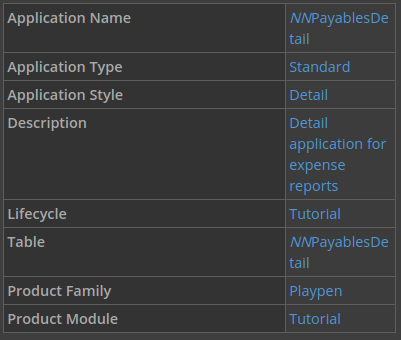

3. Configure the List Form Fields page with the following information:

> ### The data items you use for this application are only a few of the data items available in the configuration of this application. A quick way to locate the data item you need is to use the filter row.

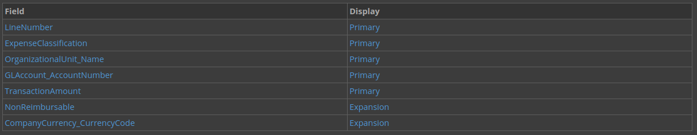

4. Configure the Detail Form Fields page with the following information:

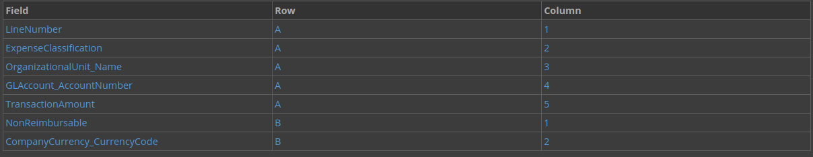

5. Save and generate your application.

### Build a header application

This application is used in the header detail application as the list form, and the header region of the generated header detail application.

1. In **Applications**, create a new application with the following information:

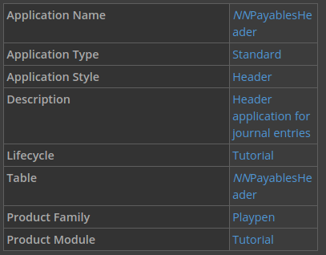

2. Set your header rows on the Pages and Rows page with the following information:

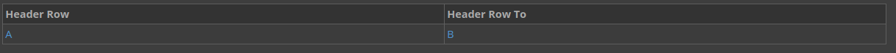

3. Use the Add button under the Rows, add your rows as follows:

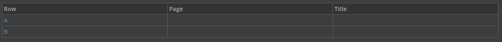

4. Configure the List Form Fields page with the following information:

> ### The data items you use for this application are only a few of the data items available in the configuration of this application. A quick way to locate the data item you need is to use the filter row.

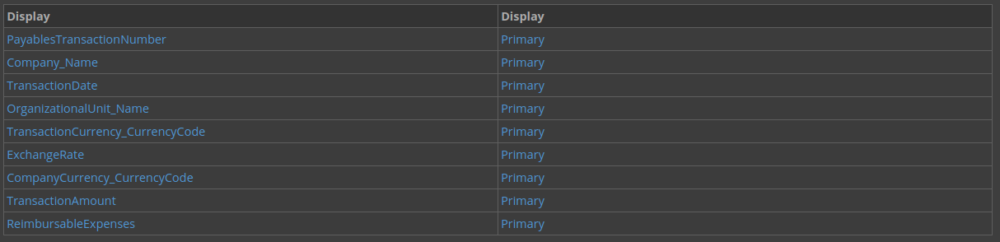

5. Configure the Detail Form Fields page with the following information:

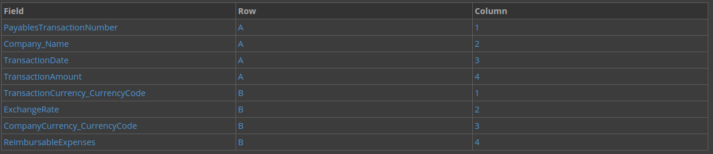

6. Save and generate your application.

### Build a header detail application

1. In **Applications**, create a new application with the following information:

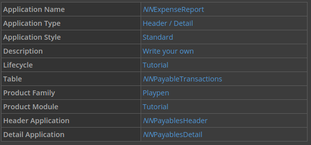

2. Save and generate your application.

---

- [Top](#Back_To_Top)

---

[Table Lookups -> nwId](https://github.com/WNortier/nextworld/blob/master/nextworld-platform-tutorials/01-build-an-application/00-build-an-application-overview.md#3_TABLE_LOOKUPS)
