---
 Top
---

- ### [1 BUILD A CURRENCY LOGIC BLOCK](#1_BUILD_A_CURRENCY_LOGIC_BLOCK)
- ### [2 CHECKPOINT](#2_CHECKPOINT)

---

## 1 BUILD A CURRENCY LOGIC BLOCK

In this section, you'll read the context and requirements for a logic block for your **NNExpenseReport** application. Then you'll create a new logic block definition and configure the logic to configure the currency code for currency fields and then set the transaction currency. After your logic block is built, you'll add it to your **NNExpenseReport** application, and then test your logic block.

### Logic block requirements

You need to build a logic block that fetches currency information, and then uses variables to set field values.

Logic blocks are built based on requirements. Here are the requirements for the logic block:

- Check if a currency field is empty

- Set a TotalAmount variable

- Create a TransactionCurrencyCode variable

- Fetch the TransactionCurrency table lookup

- Set the **TransactionCurrencyCode**

- Set **TransactionAmount**, **ReimbursableExpenses**, and **NonReimbursableExpenses** to ZeroCurrency

- Set the currency code for **TransactionAmount**, **ReimbursableExpenses**, and **NonReimbursableExpenses**

- Add your logic block to your application

### Create a new logic block definition

1. Open the **Logic Blocks** application, and then click **Create**.

2. Enter the following information, and then save.

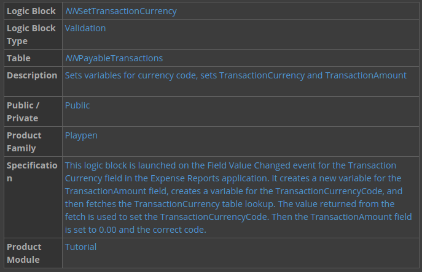

> ### You must build your logic block in the same lifecycle as your table. The only exception to this is if the table you use is in the base lifecycle. If you create your logic block in a different lifecycle, you can't save your logic block and you receive an error.

### Check if TransactionCurrency is empty

In this section, you'll use a conditional action to check if **TransactionCurrency** is empty. This action is done first because you must have a currency associated with your transaction.

1. In the **Logic Blocks** application, filter for your `NNSetTransactionCurrency` logic block.

2. Open the actions menu and select **Logic Block Builder** to open the Logic Block Builder.

3. Drag the **Conditional** action from the Actions (left) panel to the Logic Block (middle) panel.

4. In the Details (right) panel, click **Add Expression**, and then enter the following:

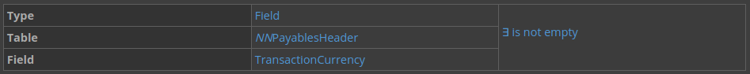

### Create a variable for TransactionCurrencyCode

Variables used in a logic block should be set at the top, before other actions. In this section, you create a variable for the transaction currency code. However, because you set the currency code based on a value from the CurrencyConfig table in a later action, set the variable value to be empty by clearing it.

1. Drag the **Set Values** action in to the Logic Block panel into the true branch of the conditional action in action 0.

2. Click **Add Assignment**, and then enter the following:

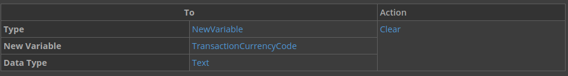

### Fetch the TransactionCurrency table lookup

Fetch the `TransactionCurrency` table lookup, which looks up on the `CurrencyConfig` table. This table defines the currencies available in the current environment and these definitions are customer-specific. Instead of hard-coding a currency value, you must fetch values from the `CurrencyConfig` table.

1. Drag the **Fetch a Table Lookup** action in to the Logic Block panel under action 1, and in the true branch of the conditional action in action 0.

2. Configure your action with the following:

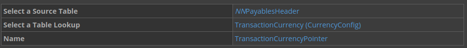

### Set the TransactionCurrencyCode

After you fetch the currency code, you can now set the currency code for your variables using the returned value.

1. Drag the **Set Values** action in to the Logic Block panel under action 2, in the Data Found loop.

2. Click **Add Assignment**, and then enter the following information:

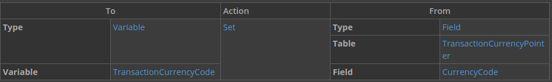

### Set the TransactionAmount = ZeroCurrency and code = TransactionCurrencyCode

1. Drag the **Set Values** action in to the Logic Block panel under action 3.

2. Click **Add Assignment**, and then enter the following information:

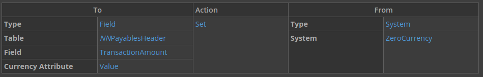

3. Add another assignment with the following information:

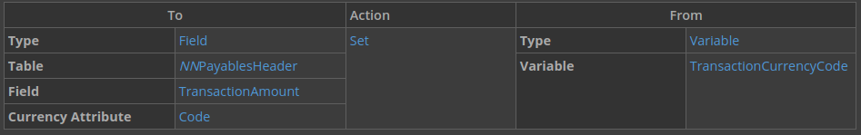

### Set ReimbursableExpenses = ZeroCurrency and code = TransactionCurrencyCode

1. Drag the **Set Values** action in to the Logic Block panel under action 4.

2. Click **Add Assignment**, and then enter the following information:

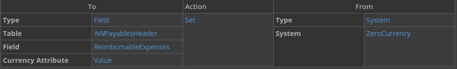

3. Add another assignment with the following information:

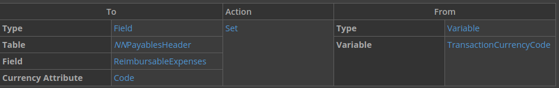

### Set NonReimbursableExpenses = ZeroCurrency and code = TransactionCurrencyCode

1. Drag the **Set Values** action in to the Logic Block panel under action 5.

2. Click **Add Assignment**, and then enter the following information:

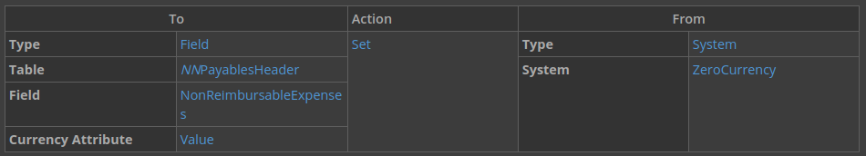

3. Add another assignment with the following information:

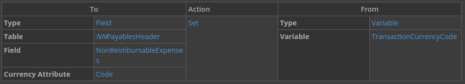

4. Save and generate your logic block.

Add your logic block to your header application

1. In **Applications**, open your **NNPayablesHeader** application for editing.

2. On the actions page under **Event Actions**, use the **Add** button to configure your logic block with the following event action:

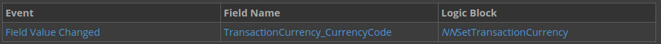

This configuration means that your logic block runs when the field value is changed.

3. Save and generate your application.

4. Generate your **NNPayablesHeader** application.

### Test your logic block.

1. After **NNPayablesHeader** is generated, generate and then launch your **NNExpenseReport** application.

2. Create a new expense report record and enter `USD` in the **Transaction Currency** field.

Note that when you do, the value of the **Transaction Amount**, **ReimbursableExpenses**, and **NonReimbursableExpenses** fields changes to `0.00 USD`.

---

- [Top](#Back_To_Top)

---

## 2 CHECKPOINT

Be able to do the following:

- Check if a currency field is empty using a conditional action
- Set a transaction currency code and a transaction currency code using new variables
- Set currency field values to ZeroCurrency
- Retrieve currency code using a fetch a table lookup action to the CurrencyConfig table
- Set the currency code of a variable
