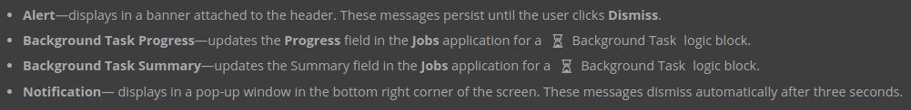

# Validation Logic Blocks

In this tutorial, you'll learn about validation logic blocks, which are used to perform advanced validation for table records. You'll learn about the fetch and math types of actions, and how to define and use variables as well as expressions. You'll also learn the specifics of the **Set Message** action, and information about choosing a message severity. After you build a header detail application for expense reports, you'll build a validation logic block to validate the values users enter are within a specific threshold.

This tutorial contains the following sections:

- Understanding validation logic blocks
- Expressions
- Set Message action
- Variables
- Math actions
- Fetches
- Build an expense report application
- Build a validation logic block

---

##  Top

---

- ### [1 UNDERSTANDING VALIDATION LOGIC BLOCKS](#1_UNDERSTANDING_VALIDATION_LOGIC_BLOCKS)
- ### [2 EXPRESSIONS](#2_EXPRESSIONS)
- ### [3 SET MESSAGE ACTIONS](#3_SET_MESSAGE_ACTIONS)
- ### [4 VARIABLES](#4_VARIABLES)
- ### [5 MATH ACTIONS](#5_MATH_ACTIONS)
- ### [6 FETCHES](#6_FETCHES)
- ### [7 BUILD AN EXPENSE REPORT APPLICATION](#7_BUILD_AN_EXPENSE_REPORT_APPLICATION)

---

## 1 UNDERSTANDING VALIDATION LOGIC BLOCKS

Validation logic blocks provide a way to create advanced validation of table records. This means that you can use a validation logic block to validate values entered in a record are correct before they are saved. You can also create basic validation on a data item level, for example field formats.

When you create a validation logic block you define the criteria for the specific validations and the fields you are validating. For example, you could use a validation logic block with a bank record application. You could configure the actions to validate values in the **Payments Applied** field were greater than zero, and that values in the **Payment Date** field do not occur after today's date.

Validation logic blocks run at different times, including when the user:

- clicks the save button

- changes a field value

- exits a detail row

If the values entered do not match the validation configuration of the logic block, the user sees an error message and their records are not saved.

---

- [Top](#Back_To_Top)

---

## 2 EXPRESSIONS

An expression is an element that a logic block action uses to operate on records. Expressions are used to identify any records in a table that the action applies to. You can add multiple expressions to an action, and then organize them based on how you want the action to apply them.

One way you control how the action uses expressions is with operators, which connect the expressions within the action. There are two operators, **And** and **Or**.

If you use **And** to connect your expressions, the action only acts on records that satisfy _all_ the expressions. If you use **Or** to connect your expressions, the action acts on records that satisfy any of the expressions.

For example, your company wants to send billing notices to customers that, after a payment, have a remaining balance that is greater than $50. You can use expressions to identify records with a payment of $100 **And** a remaining balance greater than or equal to $50. If you use expressions to identify records with a payment of $100 **Or** a remaining balance greater than or equal to \$50, the group of customers you identify for billing notices would change.

---

- [Top](#Back_To_Top)

---

## 3 SET MESSAGE ACTIONS

You can use the **Set Message** action to communicate important information to application users.

Messages provide a way to convey information that is a result of a logic block, such as a calculation. For example, you can set an error message in a directory application when a user enters a birth date that occurs in the future.

To use a **Set Message** action in a logic block, you must create a data item of type Message. The help text that you configure in the data item displays in the application as the message. Storing and maintaining the message information in a data item rather than in the logic block keeps messages consistent and organized, and makes translation easier.

You can create different types of error messages for different situations and choose where the message displays. You can create the following types of message:

You can learn more about the message severities and when to use each in the **_MESSAGE SEVERITY_** topic.

---

- [Top](#Back_To_Top)

---

## 4 VARIABLES

Use a variable to define a value that is not found in an application. Variables are values that, once defined, can be reused throughout a logic block. Once a variable is defined, any actions that appear later in the logic block can access it. However, a variable is a temporary value used only in the logic block. It is not saved to the table or application record.

In a logic block, variables can be used like a field in expressions and actions. For example, you could use a variable named `TodaysDate` to perform date math, or a variable named `StartTime` to set a value. Variables can be user-defined or system-defined. System-defined variables are organized by data type, such as date or time.

When you copy actions between logic blocks, variables have a special pattern when copied. The definition of the variable copies, but not the name. This means you need to update the values and names of variables if you copy an action between logic blocks that uses variables. If you copy actions in a logic block that use a variable, but not the action that defines the variable you need to redefine the variable in the logic block. When you copy actions that use a variable, and the action that defines the variable, you need to add the variable name to the action in the destination logic block.

---

- [Top](#Back_To_Top)

---

## 5 MATH ACTIONS

You can use different logic block actions to complete math actions using values in your application.

For example, you can:

For example, you can:

- Add
- Subtract
- Multiply
- Divide

When you use one of these actions you define the _inputs_ and the _output_. The inputs are the values used in the calculation. They can be variables, such as today's date, or fields in the application. You can also define the input value as a constant. Every time you use a constant in an action you must define the value because constants cannot be reused. In math actions, a constant can be a number or a currency value. The output is where the calculated value is used, and whether the calculated value is stored as a variable or in a field. Outputs that are variables only exist within the logic block, and outputs that are fields are stored with the application.

For example, if you use a **Subtract** action to calculate the remaining balance for a general ledger application your inputs would be `Balance Due` minus `Payments Applied`. You would define your output either as a variable named `Remaining Balance` to be used later in the logic block, or save the output to the Remaining Balance field to be saved in the application.

For a math action, when you add an input or an output, the first field you define is the value type. Value types include:

- **Field** — a field that the logic block has access to. You can use fields from the current table, a secondary table, or a module setting.

- **Constant** — a user-defined value. This can be a number or a currency value. This type is only valid for input values.

- **Variable** — a variable that has been previously defined in the logic block.

Read more in the **_VALUE TYPES_** topic.

After you define the value type you define the value. If the value is a constant, you need to define the data type as either a number or a currency. If the value is a field, the data type is automatically populated.

If you want the calculated value to be rounded, you can choose one of the following rounding options:

- **Round** — rounds values to the nearest whole number. For example 1.5 pounds would round up to 2, and 1.4 would round down to 1.

- **Round Up** — rounds the value up to the nearest whole number. For example, 26.3 would round up to 27.

- **Round Down** — rounds the value down to the nearest whole number. For example, 26.6 would round down to 26.

If you do not select a rounding option, no rounding is applied to the calculated value.

---

- [Top](#Back_To_Top)

---

## 6 FETCHES

Logic blocks contain a number of fetch actions that allow you to access data from different sources.

There are two types of fetch actions that you can use in a logic block: fetch actions that retrieve from the database and fetch actions that are limited to data that is exclusive to that specific logic block.

### Fetch from database

The following fetch actions are designed to retrieve records from the database. When the logic block fetches the records, it gains access to and loops over each record.

### Fetch within logic block

The following fetch actions are designed to retrieve data created and stored within a logic block. These fetch actions do not leave the confines of the logic block and are not able to interact with the database.

---

- [Top](#Back_To_Top)

---

## 7 BUILD AN EXPENSE REPORT APPLICATION

[Build an expense report application](https://github.com/WNortier/nextworld/blob/master/nextworld-platform-tutorials/06-currency-%26-logic-blocks/01-currency-in-logic-blocks.md#3_BUILD_AN_EXPENSE_REPORT_APPLICATION)

---

- [Top](#Back_To_Top)

---
