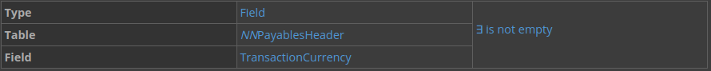
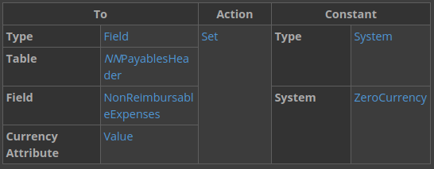
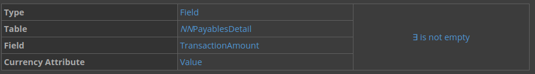

---
 Top
---

- ### [1 BUILD A VALIDATION LOGIC BLOCK](#1_BUILD_A_VALIDATION_LOGIC_BLOCK)
- ### [2 CHECKPOINT](#2_CHECKPOINT)

---

## 1 BUILD A VALIDATION LOGIC BLOCK

In this section, you'll build an expense report header detail application using existing tables. Then you'll build a logic block to use in the application that calculates and validates expense amounts in the report.

### Logic block requirements

In other logic block tutorials, you'll get logic block requirements and build the logic block yourself. In this tutorial, you'll get step-by-step instructions for building your logic block. Logic blocks are always built based on requirements, and you will always receive requirements before you build a logic block.

The purpose of the logic block you build is to validate that values users enter are valid and within acceptable values. If they're over a certain amount, they'll need to contact their account manager before they can submit their report.

Here are the requirements for the logic block you build:

- Check if **TransactionCurrency** is empty.

- Set fields to 0. Set the values of the **Transaction Amount**, **Non-reimbursable Expenses**, and **Reimbursable Expenses** fields to `ZeroCurrency`.

- Create a variable for `TransactionCurrencyCode` and set the value from the `CurrencyConfig` table.

- Fetch detail records. Fetch the `PayablesDetail` records.

- Set an error message. Set an error if the **Transaction Amount** is not greater than 0.

- Calculate the **Transaction Amount** in the header. Add the **Reimbursable Expenses** and the **Non-Reimbursable Expenses** totals field values in the header to calculate the **Transaction Amount** total in the header.

### Create a new logic block definition

1. Open the **Logic Blocks** application, and then click **Create**.

2. Enter the following information, and then save.

> ### You must build your logic block in the same lifecycle as your table. The only exception to this is if the table you use is in the base lifecycle. If you create your logic block in a different lifecycle, you will not be able to save your logic block and you will receive an error.

### Check if TransactionCurrency is empty

1. In the **Logic Blocks** application, filter for your `NNValidateTotalExpenses` logic block.

2. Open the actions menu and select **Logic Block Builder** to open the Logic Block Builder.

3. Drag the **Conditional** action from the Actions (left) panel to the Logic Block (middle) panel.

4. In the Details (right) panel, click **Add Expression**, and then enter the following:

### Set total fields to ZeroCurrency

In this section, use a **Set Values** action to set the values of the **Transaction Amount**, **Non-reimbursable Expenses**, and **Reimbursable Expenses** fields to the system value `ZeroCurrency`.

1. Drag the **Set Values** action in to the Logic Block panel after action 0.

2. In the Details panel, click **Add Assignment**, and then enter the following:

3. Add another assignment with the following:

4. Add another assignment to set the value of the **NonReimbursableExpenses** field to `0` with the following:

### Create a variable for TransactionCurrencyCode

1. Drag the **Set Values** action in to the Logic Block panel under action 1, and in the true branch of the conditional action in action 0.

2. Click **Add Assignment**, and then enter the following:

### Fetch the TransactionCurrency table lookup

1. Drag the **Fetch a Table Lookup** action in to the Logic Block panel under action 02, and in the true branch of the conditional action in action 0.

2. Configure your action with the following:

Set the TransactionCurrencyCode

1. Drag the **Set Values** action in to the Logic Block panel under action 3, in the Data Found loop.

2. Click **Add Assignment**, and then enter the following information:

### Set TransactionCurrencyCode for total fields

1. Drag the **Set Values** action in to the Logic Block panel, after action 4, in the true branch of the conditional action in action 0. This should not be in the Data Found or the No Data branch of the fetch in action 3.

2. In the Details panel, click **Add Assignment**, and then enter the following:

3. Add another assignment with the following:

4. Add another assignment to set the value of the **NonReimbursableExpenses** field to `TransactionCurrencyCode` with the following:

### Fetch detail records

1. Drag the **Fetch Detail Records** action from the Actions panel to the Logic Block panel, under action 5.

2. In the **Name** field, enter `NNPayablesDetail`, and set the Fetch Type to `Fetch All`.

### Check if TransactionAmount is not empty and greater than 0

1. Drag the **Conditional** action in to the Logic Block panel, under action 6 and in the loop body.

2. Add an expression with the following information:

3. Add another expression with the following information:

4. Below the **Add Expression** button, select `AND` to group your expressions.

### Check if NonReimbursable is true

1. Drag the **Conditional** action into the loop body in the Logic Block pane into the true branch of action 07.

2. Add an expression with the following information:

### Add the NonReimbursable expenses

1. Drag the **Add** action into the true branch of the conditional, after action 8.

2. Use the **Add Input** button to enter the following inputs:

3. Use the **Add Output** button to enter the following:

### Add the Reimbursable expenses

1. Drag the **Add** action into the false branch of the conditional in action 8.

2. Use the **Add Input** button to enter the following inputs:

3. Use the **Add Output** button to enter the following:

4. Click **Save and Exit**.

### Create a message data item

You need to create an error message that relays the necessary information. The first step is to create a Message data item.

1. Create a new data item with the following information:

2. On the Synonyms page, enter the following:

3. Click **Save and Exit**.

### Set an error message

Navigate back to **Logic Blocks**, and then open your logic block in the Logic Block Builder.

1. Drag the **Set Message** action into the false branch of action 8.

2. Use **Add Input** to enter the following:

Calculate the Transaction Amount in the header

1. Drag the **Add** action below the body of the conditional after action 11, but in the loop body of action 6.

2. Use the **Add Input** button to enter the following:

3. Use the **Add Output** button to enter the following:

4. Save and generate your logic block.

### Add your logic block to your application

1. In **Applications**, open your `NNPayablesDetail` application for editing.

2. On the actions page under `Event Actions`, use the `Add` button to configure your logic block with the following event actions:

This configuration means that your logic block runs when a row is exited and when a row is deleted.

3. Save your application.

### Test your logic block.

1. Generate, and then launch your **NNExpenseReport** application.

2. Create a new expense report record and enter values in the header fields.

3. Use the **Add Expense Report Detail** button to add reimbursable detail records with different amounts.

Note that after you enter a detail record, the values in the **Transaction Amount** and **Reimbursable Expenses** fields in the header change as records are added in the detail.

4. Use the **Add Expense Report Detail** button to add non-reimbursable detail records with different amounts.

Note that after you enter a detail record, the values in the **Transaction Amount** field in the header changes as records are added in the detail, but the **Reimbursable Expenses** field doesn't.

5. Add a detail record with a negative amount.

Note that after you exit the row, you get an error message.

---

- [Top](#Back_To_Top)

---

## 2 CHECKPOINT

Be able to do the following:

- Create a logic block definition
- Create a message data item
- Create a set values action
- Use conditional actions
- Use a logic block action to fetch detail records
- Set an error message in a logic block
- Test your logic block works correctly

---

- [Top](#Back_To_Top)

---

<!-- [Table Lookups -> nwId](https://github.com/WNortier/nextworld/blob/master/nextworld-platform-tutorials/01-build-an-application/00-build-an-application-overview.md#3_TABLE_LOOKUPS) -->
