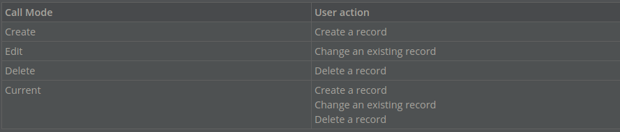

# Understanding Transaction Logic Blocks

Transaction logic blocks provide a way to change tables by updating, inserting, or deleting records.

In comparison, validation logic blocks fetch records, and then validate without changing the records. In other words, validation logic blocks fetch and verify records, and transaction logic blocks change them.

---

##  Top

---

- ### [NEXTWORLD EXAMPLE WriteDonationReceipts TRANSACTION LOGIC BLOCK](#1_NEXTWORLD_EXAMPLE_WriteDonationReceipts_TRANSACTION_LOGIC_BLOCK)
- ### [2 NEXTWORLD EXAMPLE UnapplyReapplyCashRecGL TRANSACTION LOGIC BLOCK](#2_NEXTWORLD_EXAMPLE_UnapplyReapplyCashRecGL_TRANSACTION_LOGIC_BLOCK)
- ### [3 NEXTWORLD EXAMPLE TransferFunds TRANSACTION LOGIC BLOCK](#3_NEXTWORLD_EXAMPLE_TransferFunds_TRANSACTION LOGIC BLOCK)
- ### [4 CALL A LOGIC BLOCK ACTION](#4_CALL_A_LOGIC_BLOCK_ACTION)

---

## NEXTWORLD EXAMPLE WriteDonationReceipts TRANSACTION LOGIC BLOCK

The `WriteDonationReceipts` logic block is a helpful example of a transaction logic block because it runs instead of the save in the application. This means that the logic block checks necessary values are correct and active, and then uses the information users enter to save a record in a different table.

### Object overview

The `WriteDonationReceipts` logic block is used in the `DonationReceipts` application to verify the entered values are valid, tracks the total donation amount, check the GL type, and then inserts a record to the GL.

This logic block retrieves the Base module `settings`. It also calls the `ValidateBankDeposits`,`RetrieveExchangeRate`, `RetrieveGLMappingTypes`, and the DeriveGLAccount logic blocks.

### Configuration elements

This logic block is unique because after it intercepts the save, it traverses the tree twice to find the company of a selected org unit for both the header and the detail tables. After that, it checks to see if the values in **Fund**, **Appeal**, and **Campaign** exist and are active. Finally, it derives the GL account based on the **GLType** value. Finally, this logic block writes a record to the GL and saves a record in the `DonationReceipts` application.

---

- [Top](#Back_To_Top)

---

## 2 NEXTWORLD EXAMPLE UnapplyReapplyCashRecGL TRANSACTION LOGIC BLOCK

The `UnapplyReapplyCashRecGL` logic block is a helpful example of a transaction logic block because it is called from an action block and processes cash receipt records that either have already been posted to the GL or do not have an applied or discount amount. In other words, this logic block takes new information that a user enters and uses it to update existing records and create new records.

### Object overview

The `UnapplyReapplyCashRecGL` logic block is used by the `WriteCashReceipts` action block in the **CashReceipts** application.

This logic block calls the `DeriveGLAccount` logic block and the `WriteGLTransaction` logic block. It also fetches the detail records for the `AppliedCashReceiptsDetail` table, and the table lookups to the ReceivablesHeader and `Directory` tables.

### Configuration elements

This logic block is configured to handle if the user is unapplying, reapplying, or initially applying payments to a customer invoice. It recalculates values for the journal entry and then writes a new journal entry record by calling the `WriteGL` logic block.

This logic block is called from the `WriteCashReceipts` action block.

---

- [Top](#Back_To_Top)

---

## 3 NEXTWORLD EXAMPLE TransferFunds TRANSACTION LOGIC BLOCK

The `TransferFund` logic block is a helpful example of a transaction logic block because is completes a transaction when users transfer a specified amount of an existing donation between funds. In addition to transferring funds, the logic block also updates the existing donation record.

Object overview

The `TransferFund` logic block is used in the `FundsTransfer` mini app, which is launched as an application link from the DonationReceiptsTransaction application.

This logic block calls the `RetrieveGLMappingTypes`, `DeriveGLAccount`, and the `WriteGLTransaction` logic blocks. It also includes actions to insert records to the `DonationReceiptsDetail` table, as well as the temp tables `GLHeaderTT` and `GLDetailTT`.

Configuration elements

This logic block is unique because it is launched from a mini app, which is launched from an application link, and is necessary to complete a business process. After the user adds all of the information in the mini app, they click the form action that runs the logic block. This application link is only available after a header detail record has been saved in the `DonationReceiptsTransaction` application.

---

- [Top](#Back_To_Top)

---

## 4 CALL A LOGIC BLOCK ACTION

Use the **Call a Logic Block** action to define a processing logic block, which runs using information passed in by the calling logic block.

Each logic block in Nextworld performs a separate function. To perform multiple functions, use multiple logic blocks. When you use a **Call a Logic Block action**, you use the _calling_ logic block to pass information to a _processing_ logic block. When the processing logic block runs, it uses that information, modifies it, and then passes updated information back to the calling logic block. The calling logic block uses the updated information in other actions. By default, the processing logic block doesn’t save the result of its processing, it just passes it back to the calling logic block.

You can specify which fields you want to pass from the calling logic block to the processing logic block, or you can specify an entire table.

### Logic Block Call Mode

The call mode is determined by a user's interaction with the application at runtime. The action that causes the logic block to run determines the call mode.

The logic block call modes are determined by the following user actions:

The processing logic block only runs if the value in the **Logic Block Call Mode** field is consistent with the user action in the application. For example, if you set the logic block call mode to `Create`, the processing logic block only runs when new records are created in the application.

If you want to always call the processing logic block as part of the calling logic block, use the `Current` call mode. The `Current` logic block call mode runs the processing logic block in whatever mode the calling logic block is currently running in. In other words, use the `Current` call mode if you want the processing logic block to run every time the calling logic block runs.

### On Error

Specify an **On Error** action to set the action that runs when an error occurs in the processing logic block. Usually this action calls another logic block or sets an error message. If there isn't an action in the **On Error** branch, the calling logic block continues to run, and any errors from the processing logic block don't display in the application.

A **Set Message** action with a severity of error stops the calling logic block execution, and displays a message to the user.

> ### Errors stop logic blocks from running, and discard any changes resulting from other actions in the logic block.

### Log Messages

Select the **Log Messages** check box to create a log of messages generated by the processing logic block. This log does not display in the application.

You can access values in the log using a **Fetch Messages** action.

> ### Displaying values in the application is helpful when testing your logic block, but is not recommended to include these messages in the final application.

You can access the values in the error message record fields when you use a **Set Value** action. When you do, the values display _in_ a field in the application, but not the entire error. These fields include **Field**, **DataItemName**, **InternalSeq**, **LogicBlock**, **MessageDescription**, and **MessageType**.

If an error occurs when the processing logic block runs, any changes made by the processing logic block are discarded. However the calling logic block continues to run if there are no actions defined in the On Error branch.

---

- [Top](#Back_To_Top)

---

[Table Lookups -> nwId](https://github.com/WNortier/nextworld/blob/master/nextworld-platform-tutorials/01-build-an-application/00-build-an-application-overview.md#3_TABLE_LOOKUPS)
