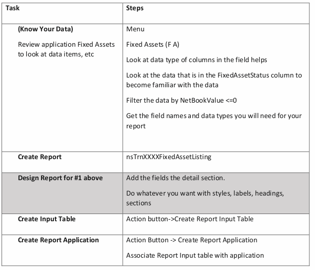
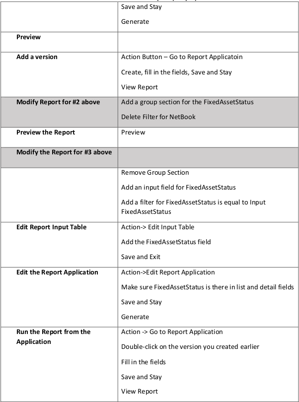

# Fixed Asset Report (Simple)

Create a report based on the Fixed Asset Application. You will modify the report 3 different times for 3
different purposes:

1. Field Asset Listing for assets with a net book value less then or equal to 0.00. Include the following fields **AssetID**, **AssetName**, **NetBookValue**, **FixedAssetStatus** in your report

2. Modify the report created in requirement one and remove the NetBookValue filter. Keep the same fields in the detail section but this time add a group for the FixedAssetStatus field. Run the report again to make sure that all assets are listed and grouped by FixedAssetStatus

3. Modify the report to have the user be able to choose what FixedAssetStatus they would like to see on the report

Make sure to save often!

