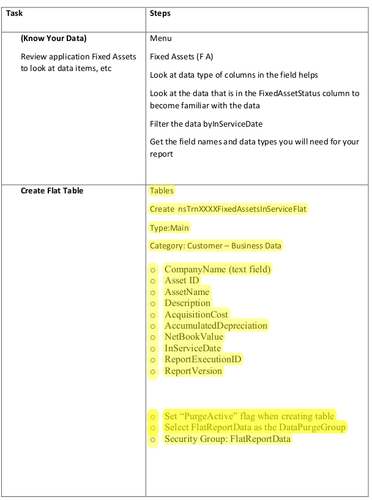
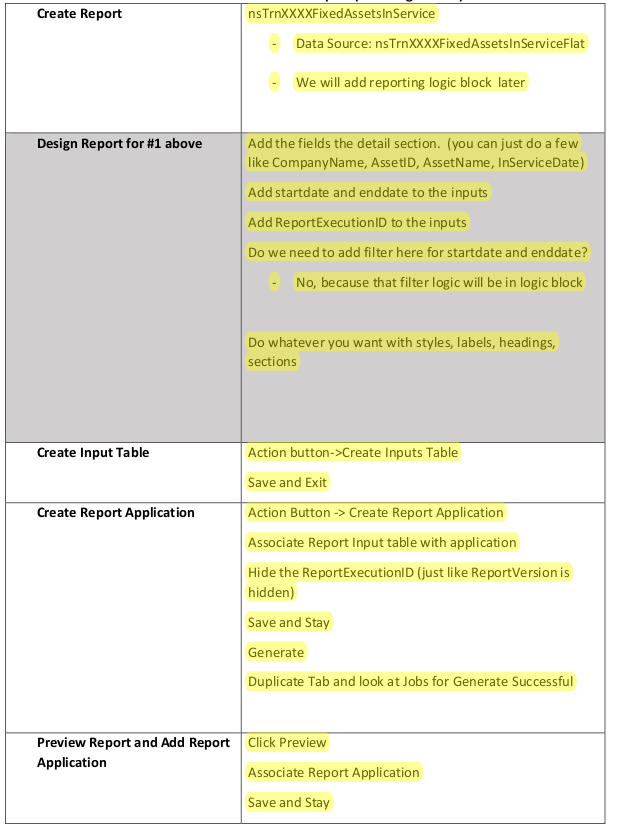
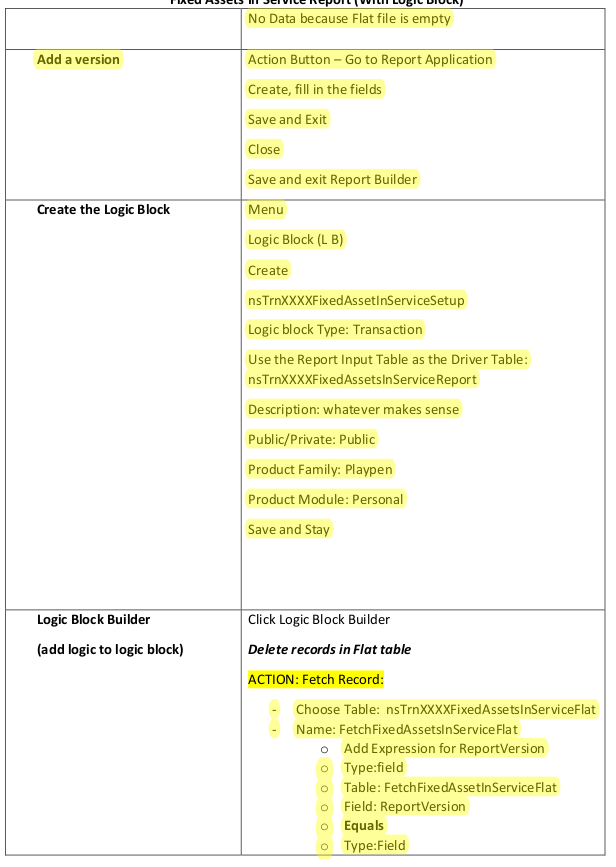
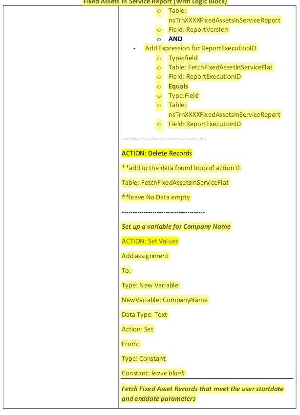
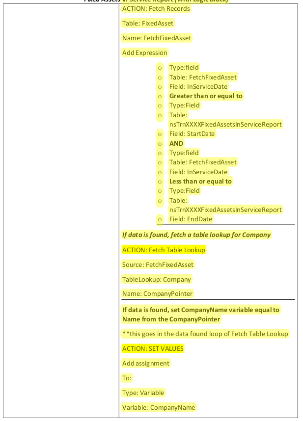
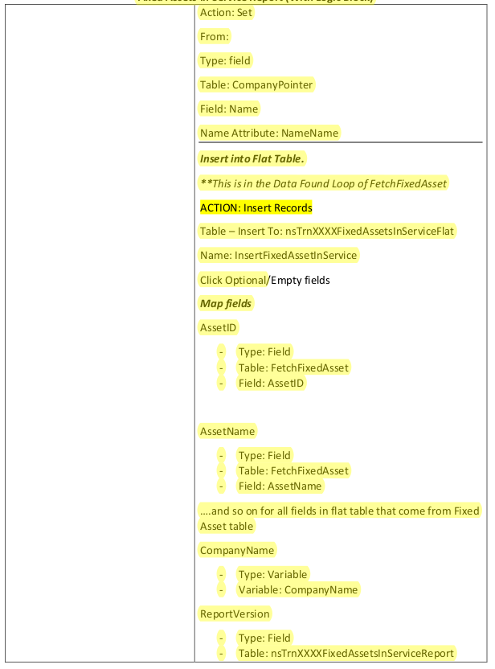

# Fixed Assets in Service Report

Create a report based Fixed Assets. The report should be designed to show fixed assets put into service
between a certain date range.

The report should show the following fields:

- Company
- AssetID
- AssetName
- Description
- AcquisitionCost
- AccumulatedDepreciation
- NetBookValue
- InServiceDate

You will need to flatten the data with a logic block for two reasons:

- User will supply the start and end date values when they run the report (Date Input fields require logic block as of this time; Use startdate and enddate as your data items)
- TableLookup for Company

Make sure to save often!

**Object Names:**

- Flat Table: nsTrnXXXXFixedAssetsInServiceFlat
- Report: nsTrnXXXXFixedAssetsInService
- Report Input Table (autonamed inside Report Builder): nsTrnXXXXFixedAssetsInServiceReport
- Report Application (autonamed inside Report Builder): nsTrnXXXXFixedAssetsInServiceReport
- Logic Block: nsTrnXXXXFixedAssetInServiceSetup

